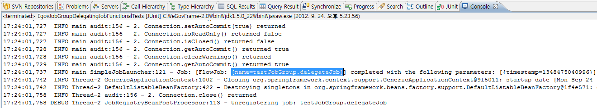

# 작업그룹 예제

## 개요
배치 수행 시, 업무에 따라 필요한 일련의 Job들을 구분하기 위해서 이를 카테고리화 하여 관리 하는 기능을 보여주는 예제이다.

## 설명
### 설정
#### Job 설정
<b>작업그룹 예제에서는 다른 예제에서 사용되는 delegatingJob 을 사용한다.</b>

Job 의 구성은 일반적인 Chunk 설정이 있다.

```xml
<job id="delegateJob" xmlns="http://www.springframework.org/schema/batch">
    <step id="delegateStep1">
        <tasklet>
            <chunk reader="reader" writer="writer" commit-interval="3"/>
        </tasklet>
    </step>
</job>
```

#### Launcher 설정
<b>작업그룹 예제의 Launcher 설정 파일인 group-job-launcher-context 를 확인한다.</b>

✔ Job 그룹기능을 사용하기 위해서는 JobRegistryBeanPostProcessor 클래스와 관련한 빈에 ‘groupName’ 이라는 프로퍼티로 그룹명을 추가하면 된다.

```xml
<bean id="jobLauncher"	class="org.springframework.batch.core.launch.support.SimpleJobLauncher">
    <property name="jobRepository" ref="jobRepository" />
</bean>

<bean class="org.springframework.batch.core.configuration.support.JobRegistryBeanPostProcessor">
<property name="jobRegistry" ref="jobRegistry"/>
<property name="groupName" value="testJobGroup"/>
</bean>

<bean id="jobRepository" class="org.springframework.batch.core.repository.support.JobRepositoryFactoryBean"
      p:dataSource-ref="dataSource" p:transactionManager-ref="transactionManager" p:lobHandler-ref="lobHandler"/>

<bean id="lobHandler" class="org.springframework.jdbc.support.lob.DefaultLobHandler"/>

<bean id="mapJobRepository" class="org.springframework.batch.core.repository.support.MapJobRepositoryFactoryBean"
      lazy-init="true" autowire-candidate="false" />

<bean id="jobOperator" class="org.springframework.batch.core.launch.support.SimpleJobOperator"
      p:jobLauncher-ref="jobLauncher" p:jobExplorer-ref="jobExplorer"
      p:jobRepository-ref="jobRepository" p:jobRegistry-ref="jobRegistry" />

<bean id="jobExplorer" class="org.springframework.batch.core.explore.support.JobExplorerFactoryBean"
      p:dataSource-ref="dataSource" />

<bean id="jobRegistry"	class="org.springframework.batch.core.configuration.support.MapJobRegistry" />
```

### JunitTest 구성 및 수행
#### JunitTest 구성
<b>group-job-launcher-context 설정과 수행할 배치 Job인 delegatingJob 설정들로 Junit Test를 수행한다. 이 때 배치가 수행되고, 관련된 내용을 확인할 수 있다.</b>

✔ JunitTest 클래스의 구조는 [배치실행환경 예제 Junit Test 설명](./batch-example-run_junit_test.md)을 참고한다.

✔ assertEquals(”[testJobGroup.delegateJob\]”,jobRegistry.getJobNames().toString()) : Job 이름이 [그룹명.Job 이름] 형식으로 저장됨을 확인한다.

```java
@ContextConfiguration(locations = { "/egovframework/batch/group-job-launcher-context.xml",
        "/egovframework/batch/jobs/delegatingJob.xml",
        "/egovframework/batch/job-runner-context.xml" })
public class EgovJobGroupDelegatingJobFunctionalTests {
	...
    @Test
    public void testLaunchJob() throws Exception {
        jobLauncherTestUtils.launchJob();
        assertTrue(personService.getReturnedCount() > 0);
        assertEquals(personService.getReturnedCount(), personService.getReceivedCount());
        assertEquals("[testJobGroup.delegateJob]",jobRegistry.getJobNames().toString());
    }
}
```

#### JunitTest 수행
수행방법은 [JunitTest 실행](https://www.egovframe.go.kr/wiki/doku.php?id=egovframework:dev2:tst:test_case)을 참고한다.

### 결과 확인
콘솔창의 로그를 확인하면 Launcher 설정파일에서 지정한 groupName(testJobGroup)이 Job 이름 앞에서 식별되는 카테고리명으로 쓰이는 것을 확인할 수 있다.



## 참고자료
- [JobRegistry](../../egovframe-runtime/batch-layer/batch-core-job_registry.md)