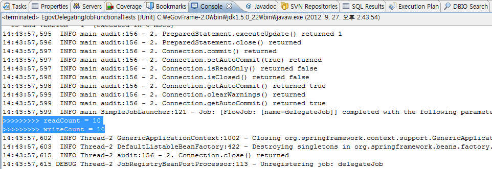

# 기존 업무 재사용 예제

## 개요
기존 업무를 배치의 ItemReader나 ItemWriter로 사용한 예제이다. 스프링 배치에서 제공하는 Item의 Adapter를 사용하면 XML설정만으로도 기존 업무를 손쉽게 사용할 수 있다. 스프링 배치에서 제공하는 Adapter 중에 ItemReaderAdapter와 PropertyExtractingDelegatingItemWriter클래스를 사용하여 기존 업무를 사용하는 기능을 예제로 제공한다.

## 설명
### 설정
#### Job 설정
<b>기존 업무 재사용 예제의 Job 설정파일인 delegatingJob.xml을 확인한다.</b>

아래의 예제에서는 targetObject로 정의된 기존 업무인 PersonService를 재사용한다. read시에는 targetMethod로 정의된 getData 메소드를 실행하고, write시에는 targetMethod로 정의된 processProcessPerson 메소드를 실행한다.

```xml
<bean id="reader" class="org.springframework.batch.item.adapter.ItemReaderAdapter">
       <property name="targetObject" ref="delegateObject" />
       <property name="targetMethod" value="getData" />
</bean>
```

```xml
<bean id="writer" class="org.springframework.batch.item.adapter.PropertyExtractingDelegatingItemWriter">
       <property name="targetObject" ref="delegateObject" />
       <property name="targetMethod" value="processPerson" />
       <property name="fieldsUsedAsTargetMethodArguments">
		<list>
			<value>firstName</value>
			<value>address.city</value>
		</list>
	</property>
</bean>
```

```xml
<bean id="delegateObject" class="egovframework.brte.sample.common.domain.person.PersonService" />
```

#### 클래스 설정
<b>위에서 정의된 기존 업무의 클래스를 확인한다.</b>

<b>주의</b> : reader의 역할을 하는 targetMethod는 다음과 같은 ItemReader의 동작방식을 만족해야 한다.

✔ 메소드 호출시 하나의 Item(Object)을 반환한다.

✔ 더 이상 반환할 Item(Object)이 없는 경우 null을 반환한다.

```java
//reader의 역할을 하는  getData() 호출시 generatedCounter가 1씩 증가하며 하나의 person이라는 Object를 반환한다. 
//또한  읽기 횟수에 제한을 두어 null을 반환하여 더이상 반환한 Item이 없다는 것을 알린다.
 
public class PersonService {
 
	private static final int GENERATION_LIMIT = 10;
 
	private int generatedCounter = 0;
	...
 
        //read
	public Person getData() {
		if (generatedCounter >= GENERATION_LIMIT)
			return null;
 
		Person person = new Person();
               ...
		generatedCounter++;
 
        return person;
        }
 
        //write
        public void processPerson(String name, String city) {
	        processedCounter++;
	}
}
```

### JunitTest 구성 및 수행
#### JunitTest 구성
<b>기존 업무 재사용 예제를 수행하고 배치작업 결과에 대한 검증을 위해 다음과 같이 @Test를 구성하였다.</b>

✔ JunitTest 클래스의 구조는 [배치실행환경 예제 Junit Test 설명](./batch-example-run_junit_test.md)을 참고한다.

✔ assertEquals(BatchStatus.COMPLETED, jobExecution.getStatus()) : 배치수행결과가 COMPLETED 인지 확인한다.

✔ assertTrue(personService.getReturnedCount() > 0), assertEquals(personService.getReturnedCount(), personService.getReceivedCount()) :기존 업무재사용 여부를 확인한다.

```java
@RunWith(SpringJUnit4ClassRunner.class)
@ContextConfiguration(locations = { "/egovframework/batch/simple-job-launcher-context.xml", "/egovframework/batch/jobs/delegatingJob.xml", "/egovframework/batch/job-runner-context.xml" })
public class EgovDelegatingJobFunctionalTests {
 
	//배치작업을  test하기 위한 JobLauncherTestUtils
	@Autowired
	private JobLauncherTestUtils jobLauncherTestUtils;
    //배치작업에 사용된 기존 업무 클래스
	@Autowired
	private PersonService personService;
 
	/**
	 * 배치작업 테스트
	 */
	@Test
	public void testLaunchJob() throws Exception {
 
		JobExecution jobExecution = jobLauncherTestUtils.launchJob();
		assertEquals(BatchStatus.COMPLETED, jobExecution.getStatus());
		assertTrue(personService.getReturnedCount() > 0);
		assertEquals(personService.getReturnedCount(), personService.getReceivedCount());
		System.out.println(">>>>>>>>> readCount = "+personService.getReturnedCount());
		System.out.println(">>>>>>>>> writeCount = "+personService.getReceivedCount());
	}
 
}
```

#### JunitTest 수행
수행방법은 [JunitTest 실행](https://www.egovframe.go.kr/wiki/doku.php?id=egovframework:dev2:tst:test_case)을 참고한다.

### 결과 확인
콘솔창의 로그를 통해 배치 작업시 기존업무를 재사용한 결과를 확인할 수 있다.



## 참고자료
- [http://static.springsource.org/spring-batch/reference/html/readersAndWriters.html#reusingExistingServices](http://static.springsource.org/spring-batch/reference/html/readersAndWriters.html#reusingExistingServices)