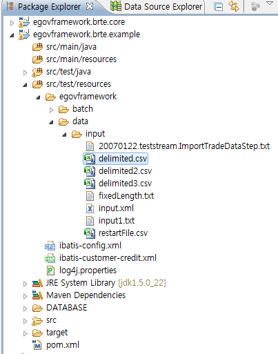
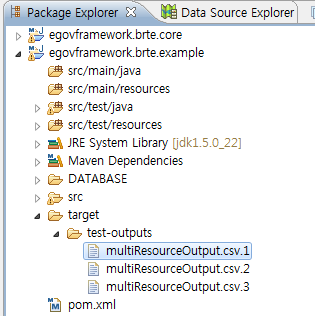

# MultiResource 예제

## 개요
한 step에서 여러개의 파일을 처리하는 기능을 예제로 제공한다. 스프링 배치에서는 MultiResourceItemReader와 MultiResourceItemWriter를 제공한다.

## 설명
### 설정
#### Job 설정
<b>MultiResource 예제의 Job 설정파일인 multiResourceIoJob.xml을 확인한다.</b>

MultiResourceItemReader는 resources로 정의된 파일들을 읽어와서, 파일 한 개씩 delegate로 정의된 reader가 read하도록 전달한다.

아래의 예제는 실제로 파일을 read하는 reader는 delegate로 정의된 FlatFileItemReader이다.

```xml
<bean id="itemReader" class="org.springframework.batch.item.file.MultiResourceItemReader" scope="step">
    <property name="delegate">
        <bean class="org.springframework.batch.item.file.FlatFileItemReader">
            <property name="lineMapper">
                <bean class="org.springframework.batch.item.file.mapping.DefaultLineMapper">
                    <property name="lineTokenizer">
                        <bean class="org.springframework.batch.item.file.transform.DelimitedLineTokenizer">
                            <property name="delimiter" value="," />
                            <property name="names" value="name,credit" />
                        </bean>
                    </property>
                    <property name="fieldSetMapper">
                        <bean class="org.springframework.batch.item.file.mapping.BeanWrapperFieldSetMapper">
                            <property name="targetType" value="egovframework.brte.sample.common.domain.trade.CustomerCredit" />
                        </bean>
                    </property>
                </bean>
            </property>
        </bean>
    </property>
    <property name="resources" value="#{jobParameters['input.file.path']}" />
</bean>
```

MultiResourceItemWriter는 itemCountLimitPerResource로 정의된 수보다 write할 item이 넘어가면 새 output파일을 생성하고, delegate로 정의된 writer가 write하도록 전달한다.

아래의 예제는 FlatFileItemWriter가 write한 item이 6이 되면 MultiResourceItemWriter가 새 output 파일을 생성하여 다시 FlatFileItemWriter가 write도록 전달한다.

```xml
<bean id="itemWriter" class="org.springframework.batch.item.file.MultiResourceItemWriter" scope="step">
	<property name="resource" value="#{jobParameters['output.file.path']}" />
	<property name="itemCountLimitPerResource" value="6" />
	<property name="delegate" ref="delegateWriter" />
</bean>
```

```xml
<bean id="delegateWriter" class="org.springframework.batch.item.file.FlatFileItemWriter">
    <property name="lineAggregator">
        <bean class="org.springframework.batch.item.file.transform.DelimitedLineAggregator">
            <property name="delimiter" value="," />
            <property name="fieldExtractor">
                <bean class="org.springframework.batch.item.file.transform.BeanWrapperFieldExtractor">
                    <property name="names" value="name,credit" />
                </bean>
            </property>
        </bean>
    </property>
</bean>
```

#### Resource 설정
Job 설정의 xml를 살펴보면 MultiResourceReader의 resources는 input.file.path의 키값으로 지정된 jobParameter의 value이다. 해당 값은 아래의 Junit 테스트케이스 파일에서 확인할 수 있다.

```
JobParameter
key: input.file.path 
value : /egovframework/data/input/delimited*.csv"
```



Job 설정의 xml를 살펴보면 MultiResourceWriter의 resource는 output.file.path의 키값으로 지정된 jobParameter의 value이다. 해당 값은 아래의 Junit 테스트케이스 파일에서 확인할 수 있으며, 파일들은 테스트 후에 확인할 수 있다.

```
  JobParameter
  key : output.file.path
  value : file:./target/test-outputs/multiResourceOutput.csv
```

### Junit 구성 및 수행
#### JunitTest 구성
<b>MutiResource 예제를 수행하고 배치작업 결과에 대한 검증을 위해 다음과 같이 @Test를 구성하였다.</b>

✔ JunitTest 클래스의 구조는 [배치실행환경 예제 Junit Test 설명](./batch-example-run_junit_test.md)을 참고한다.

✔ getUniqueJobParameters에서 JobParameter에 배치에 필요한 입력 리소스, 출력 리소스 위치정보를 넘긴다.

✔ EgovAbstractIoSampleTests에서는 배치를 수행하고 배치작업 전후의 데이터를 비교확인한다.

✔ assertEquals(BatchStatus.COMPLETED, jobExecution.getStatus()):배치수행결과가 COMPLETED 인지 확인한다.

```java
*/
@RunWith(SpringJUnit4ClassRunner.class)
@ContextConfiguration(locations ="/egovframework/batch/jobs/multiResourceIoJob.xml" )
public class EgovMultiResourceFunctionalTests extends EgovAbstractIoSampleTests {
 
    ...
 
	@Override
	protected JobParameters getUniqueJobParameters() {
 
		JobParametersBuilder builder = new JobParametersBuilder(super.getUniqueJobParameters());
		return builder.addString("input.file.path", "/egovframework/data/input/delimited*.csv").addString(
			"output.file.path", "file:./target/test-outputs/multiResourceOutput.csv").toJobParameters();
    }
```

```java
@ContextConfiguration(locations = { "/egovframework/batch/simple-job-launcher-context.xml", "/egovframework/batch/job-runner-context.xml"})
@TestExecutionListeners( { DependencyInjectionTestExecutionListener.class, StepScopeTestExecutionListener.class })
public abstract class EgovAbstractIoSampleTests {
 
	//배치작업을  test하기 위한 JobLauncherTestUtils
	@Autowired
	@Qualifier("jobLauncherTestUtils")
	private JobLauncherTestUtils jobLauncherTestUtils;
 
	//배치작업의  reader
	@Autowired
	private ItemReader<CustomerCredit> reader;
 
	/**
	 * 배치작업 테스트
	 */
	@Test
	public void testUpdateCredit() throws Exception {
 
		open(reader);
		List<CustomerCredit> inputs = getCredits(reader);
		close(reader);
 
		JobExecution jobExecution = jobLauncherTestUtils.launchJob(getUniqueJobParameters());
		assertEquals(BatchStatus.COMPLETED, jobExecution.getStatus());
 
		pointReaderToOutput(reader);
		open(reader);
		List<CustomerCredit> outputs = getCredits(reader);
		close(reader);
 
		assertEquals(inputs.size(), outputs.size());
		int itemCount = inputs.size();
		assertTrue(itemCount > 0);
 
		for (int i = 0; i < itemCount; i++) {
			assertEquals(inputs.get(i).getCredit().add(CustomerCreditIncreaseProcessor.FIXED_AMOUNT).intValue(),
					outputs.get(i).getCredit().intValue());
		}
 
	}
 
   ...
}
```

#### JunitTest 수행
수행방법은 [JunitTest 실행](https://www.egovframe.go.kr/wiki/doku.php?id=egovframework:dev2:tst:test_case)을 참고한다.

### 결과확인
MultiReourceWriter의 결과로 여러 파일이 생성되었는지를 확인한다.



## 참고자료
- [multidata_process](../../../egovframe-runtime/batch-layer/batch-core-multidata_process.md)
- [http://static.springsource.org/spring-batch/reference/html/readersAndWriters.html#multiFileInput](./http://static.springsource.org/spring-batch/reference/html/readersAndWriters.html#multiFileInput)
