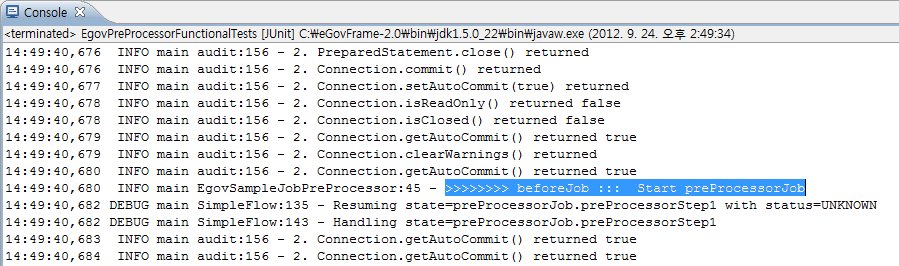

# 작업 전후처리 예제

## 개요
전자정부 표준프레임워크에서 배치 수행시, Core에서 제공하는 Processor 클래스를 이용하여 Job과 그 하위 구성요소인 Step, Chunk 전후에 적절한 선행/후행 처리 과정을 보여주는 예제이다.

## 설명
예제는 작업 전처리 과정을 보여주는 EgovPreProcessorFunctionalTests 와 작업 후처리 과정을 보여주는 EgovPostProcessorFunctionalTests로 구성되어 있다. 전처리, 후처리에 따른 일부 메소드명을 제외한 대부분의 설정과 내용이 같으므로 작업 전처리 예제(EgovPreProcessorFunctionalTests)위주로 설명한다.

### 설정
#### Job 설정
<b>작업 전처리 예제의 Job 설정 파일인 preProcessorJob.xml을 확인한다.</b>

작업 전처리 예제, 작업 후처리 예제에서는 \<listener>를 적절히 이용하여 Pre/PostProcessor를 사용한다. 여기서 빈으로 등록된 각 SampleXXXProcessor 클래스들은 전자정부 표준프레임워크의 Processor를 상속받아 구현하였으며, 관련된 상세 내용은 [작업 전후처리 관리](../../../egovframe-runtime/batch-layer/batch-core-listener.md)에서 확인할 수 있다.

✔ \<listeners> 설정위치는 관련된 태그 안에 설정하는 것을 권장한다. (ex. Job과 관련된 Listener는 Job 태그 내부에서 사용하고, Step과 관련된 Listener는 Step 태그 내부에서 사용한다.)

```xml
<job id="preProcessorJob" xmlns="http://www.springframework.org/schema/batch">
	<listeners>
		<listener ref="jobPreListener" />
	</listeners>
	<step id="preProcessorStep1">
		<tasklet>
			<chunk reader="itemReader" writer="itemWriter" commit-interval="2">
				<listeners>
					<listener ref="chunkPreListener" />
				</listeners>
			</chunk>
		</tasklet>
		<listeners>
			<listener ref="stepPreListener" />
		</listeners>
	</step>
</job>
 
<bean id="jobPreListener" class="egovframework.brte.sample.example.listener.EgovSampleJobPreProcessor" />
<bean id="stepPreListener" class="egovframework.brte.sample.example.listener.EgovSampleStepPreProcessor" />
<bean id="chunkPreListener" class="egovframework.brte.sample.example.listener.EgovSampleChunkPreProcessor" />
```

#### 클래스 설정
<b>전자정부 표준프레임워크에서 제공하는 Processor를 구성요소(Job, Step, Chunk)별로 상속받아 간단한 로그를 찍는 SampleProcessor를 만들었다. 로그 출력위치를 보면서 리스너의 수행시점을 확인할 수 있다.</b>

✔ 전자정부 표준프레임워크에서 제공하는 Processor 는 코어의 작업 전후처리(Pre Processor / Post Processor)관리 참고한다.

- Job 수행 이전에 호출되는 메소드

```java
public class EgovSampleJobPreProcessor extends EgovJobPreProcessor {
	protected Log log = LogFactory.getLog(this.getClass());
	public void beforeJob(JobExecution jobExecution) {
		log.info(">>>>>>>> beforeJob :::  Start " + jobExecution.getJobInstance().getJobName());
	}
}
```

- Job 수행 이후에 호출되는 메소드

```java
public class EgovSampleJobPostProcessor extends EgovJobPostProcessor {
	protected Log log = LogFactory.getLog(this.getClass());
	public void afterJob(JobExecution jobExecution) {
		log.info(">>>>>>>> afterJob :::  Finish " + jobExecution.getJobInstance().getJobName());
	}
}
```

- Step 수행 이전에 호출되는 메소드

```java
public class EgovSampleStepPreProcessor<T, S> extends EgovStepPreProcessor<T, S> {
	protected Log log = LogFactory.getLog(this.getClass());
	public void beforeStep(StepExecution stepExecution) {
		log.info(">>>>>>>> beforeStep ::: start " + stepExecution.getStepName());
	}
}
```

- Step 수행 이후에 호출되는 메소드

```java
public class EgovSampleStepPostProcessor<T, S> extends EgovStepPreProcessor<T, S> {
	protected Log log = LogFactory.getLog(this.getClass());
	public ExitStatus afterStep(StepExecution stepExecution) {
		log.info(">>>>>>>> afterStep ::: finish " + stepExecution.getStepName());
		return null;
	}
}
```

- Chunk 수행 이전에 호출되는 메소드

```java
public class EgovSampleChunkPreProcessor extends EgovChunkPreProcessor {
	protected Log log = LogFactory.getLog(this.getClass());
	public void beforeChunk() {
		log.info(">>>>>>>> beforeChunk :::");
	}
}
```

- Chunk 수행 이후에 호출되는 메소드

```java
public class EgovSampleChunkPostProcessor extends EgovChunkPostProcessor {
	protected Log log = LogFactory.getLog(this.getClass());
	public void afterChunk() {
		log.info(">>>>>>>> afterChunk :::");
	}
}
```

### JunitTest 구성 및 수행
#### JunitTest 구성
<b>preProcessorJob 설정과 관련 클래스들로 Junit Test를 수행한다. 이 때 배치가 수행되고, 관련된 내용을 확인할 수 있다.</b>

✔ JunitTest 클래스의 구조는 [배치실행환경 예제 Junit Test 설명](./batch-example-run_junit_test.md)을 참고한다.

✔ assertEquals(“COMPLETED”, jobExecution.getExitStatus().getExitCode()) : 배치수행결과가 COMPLETED 인지 확인한다.

✔ getUniqueJobParameters에서 JobParameter에 배치에 필요한 입력 리소스, 출력 리소스 위치정보를 넘긴다.

```java
@ContextConfiguration(locations = { "/egovframework/batch/jobs/preProcessorJob.xml" })
public class EgovPreProcessorFunctionalTests extends EgovAbstractIoSampleTests {
 
	@Test
	public void testUpdateCredit() throws Exception {
		JobExecution jobExecution = jobLauncherTestUtils.launchJob(getUniqueJobParameters());
 
		// 콘솔창의 Job,Step,Chunk의 이벤트 처리 출력여부로 성공여부 판단 할 것	
		assertEquals("COMPLETED", jobExecution.getExitStatus().getExitCode());
	}
	/*
	* 잡파라미터를 설정하기 위한 메소드 
	*/
	@Override
 
	protected JobParameters getUniqueJobParameters() {
		return new JobParametersBuilder(super.getUniqueJobParameters())
			.addString("inputFile","/egovframework/data/input/delimited.csv")
			.addString("outputFile","file:./target/test-outputs/delimitedOutput.csv")
			.toJobParameters();
	}
}
```

#### JunitTest 수행
수행방법은 [JunitTest 실행](https://www.egovframe.go.kr/wiki/doku.php?id=egovframework:dev2:tst:test_case)을 참고한다.

### 결과 확인
이 예제의 테스트 결과는 배치수행 결과만 반영하므로, 전처리/후처리 성공여부는 콘솔창에서 로그내용을 검색하여 해당 로그의 출력여부로 확인할 수 있다.



## 참고자료
- [Listener](../../../egovframe-runtime/batch-layer/batch-core-listener.md)