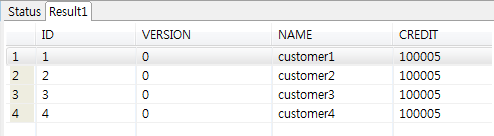
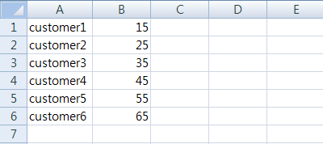

# 저장소(Repository) 예제

## 개요
배치 수행 시, 데이터 처리 대상(DB,File등)에 대한 설정을 보여주는 예제이다. EgovRepositoryFunctionalTests 예제는 리소스가 DB 인 jdbcCursorIoJob 과 리소스가 File인 delimitedIoJob의 수행과정을 보여주면서, 데이터가 DB에서 DB로 File 에서 File로 처리 된다.

## 설명
### 설정
#### Job 설정
<b>저장소(Repository) 예제의 Job 설정 파일인 repositoryJob.xml 을 확인한다.</b>

Job 의 구성을 보면 리소스 타입에 따라 두 개의 Job으로 구성되어 있고, 각 타입에 따른 Reader와 Writer를 사용하게 된다.

- jdbcCursorIoJob : 리소스가 DB인 Job
- delimitedIoJob : 리소스가 파일인 Job

```xml
<!--resource가 DB일 경우 xml에 등록 -->
<job id="jdbcCursorIoJob" xmlns="http://www.springframework.org/schema/batch">
  <step id="jdbcCursorIoStep1">
    <tasklet>
      <chunk reader="itemReaderDB" processor="itemProcessor" writer="itemWriterDB" commit-interval="2" />
    </tasklet>
  </step>
</job>
        
<!--resource가 파일일 경우 xml에 등록 또는 JobParameter에 등록 -->
<job id="delimitedIoJob" xmlns="http://www.springframework.org/schema/batch">
<step id="delimitedIostep1">
  <tasklet>
    <chunk reader="itemReaderFile" processor="itemProcessor" writer="itemWriterFile" commit-interval="2"/>
  </tasklet>
</step>
</job>
```

### JunitTest 구성 및 수행
#### JunitTest 구성
<b>repositoryJob 설정과 관련 클래스들로 Junit Test를 수행한다. 이 때 배치가 수행되고, 관련된 내용을 확인할 수 있다.</b>

✔ JunitTest 클래스의 구조는 [배치실행환경 예제 Junit Test 설명](./batch-example-run_junit_test.md)을 참고한다.

✔ assertEquals(BatchStatus.COMPLETED, jobExecution.getStatus()) : 배치수행결과가 COMPLETED 인지 확인

✔ jobLauncher.run(jobRegistry.getJob(“jdbcCursorIoJob”), getUniqueJobParameters(“jdbcCursorIoJob”)) : 이름이 jdbcCursorIoJob 인 Job을 수행

✔ getUniqueJobParameters에서 JobParameter에 배치에 필요한 입력 리소스, 출력 리소스 위치정보를 넘김

```java
@ContextConfiguration(locations = {
        "/egovframework/batch/simple-job-launcher-context.xml",
        "/egovframework/batch/jobs/repositoryJob.xml" })
public class EgovRepositoryFunctionalTests {

  @Test
  public void testUpdateCredit() throws Exception {
    // 1. resource가 DB인 Job 실행
    JobExecution jobExecution = jobLauncher.run(jobRegistry.getJob("jdbcCursorIoJob"),getUniqueJobParameters("jdbcCursorIoJob"));
    assertEquals(BatchStatus.COMPLETED, jobExecution.getStatus());

    // 2. resource가 file 인 Job 실행
    jobExecution = jobLauncher.run(jobRegistry.getJob("delimitedIoJob"),getUniqueJobParameters("delimitedIoJob"));
    assertEquals(BatchStatus.COMPLETED, jobExecution.getStatus());
  }

  /**
   * 잡파라미터를 설정하기 위한 메소드
   */
  protected JobParameters getUniqueJobParameters(String jobName) {

    JobParametersBuilder builder = new JobParametersBuilder();
    // Job 파라미터로 등록 가능
    builder.addString("inputFile",	"/egovframework/data/input/delimited.csv");
    builder.addParameter("timestamp", new JobParameter(new Date().getTime()));

    JobParameters jobParameters = builder.toJobParameters();
    return jobParameters;
  }
}
```

#### JunitTest 수행
수행방법은 [JunitTest 실행](https://www.egovframe.go.kr/wiki/doku.php?id=egovframework:dev2:tst:test_case)을 참고한다.

### 결과 확인
- DB의 CUSTOMER 테이블을 보면 Repository 타입이 DB인 데이터 처리 결과를 확인할 수 있다.



- delimitedOutput.csv 파일을 보면 Repository 타입이 File인 데이터 처리 결과를 확인할 수 있다.



## 참고자료
- [JobRepository](../../../egovframe-runtime/batch-layer/batch-execution-job-repository.md)
- [ItemReader](../../../egovframe-runtime/batch-layer/batch-core-item_reader.md)
- [ItemWriter](../../../egovframe-runtime/batch-layer/batch-core-item_writer.md)