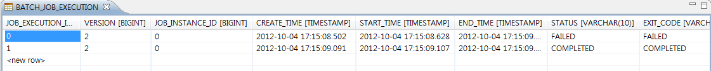

# Restart 예제

## 개요
Job이 restart 되는 기능을 예제로 제공한다.

## 설명
### 설정
#### Job 설정
<b>Restart 예제의 Job 설정파일인 restartFileSampleJob.xml을 확인한다.</b>

job을 재실행할 수 있는지 여부를 Job 설정시 지정할 수 있다. 디폴트는 true이고 아래와 같이 restartable 설정에 따라 지정할 수 있다.

<b>재실행 가능</b>

```xml
	<job id="restartFileSampleJob" xmlns="http://www.springframework.org/schema/batch">
		<step id="restartFileSampleStep1">
			<tasklet>
				<chunk reader="itemReader" processor="itemProcessor" writer="itemWriter"
					commit-interval="5"/>
			</tasklet>
		</step>
	</job>
```

<b>재실행 불가능</b>

```xml
	<job id="restartFileSampleJob" restartable="false" xmlns="http://www.springframework.org/schema/batch">
		<step id="restartFileSampleStep1">
			<tasklet>
				<chunk reader="itemReader" processor="itemProcessor" writer="itemWriter"
					commit-interval="5"/>
			</tasklet>
		</step>
	</job>
```

### JunitTest 구성 및 수행
#### JunitTest 구성
<b>Restart 예제를 수행하고 배치작업 결과에 대한 검증을 위해 다음과 같이 @Test를 구성하였다.</b>

✔ JunitTest 클래스의 구조는 [배치실행환경 예제 Junit Test 설명](./batch-example-run_junit_test.md)을 참고한다.

✔ CustomerCreditFlatFileItemWriter 클래스 : 배치수행시 failed를 발생시킨다.

✔ assertEquals(BatchStatus.FAILED, je1.getStatus()); : 배치 첫수행결과가 FAILED 인지 확인한다.

✔ assertEquals(BatchStatus.COMPLETED, je2.getStatus()); : 배치 재수행결과가 COMPLETED 인지 확인한다.

```java
@RunWith(SpringJUnit4ClassRunner.class)
@ContextConfiguration(locations = { "/egovframework/batch/simple-job-launcher-context.xml", "/egovframework/batch/jobs/restartFileSampleJob.xml",
		"/egovframework/batch/job-runner-context.xml" })
public class EgovRestartFileSampleFunctionalTests {
 
	//배치작업의 outputResource
	@Autowired
	private Resource outputResource;
 
	//배치작업을  test하기 위한 JobLauncherTestUtils
	@Autowired
	private JobLauncherTestUtils jobLauncherTestUtils;
 
 
	/**
	 * 배치작업 테스트
	 */
	@Test
	public void runTest() throws Exception {
		JobParameters jobParameters = jobLauncherTestUtils.getUniqueJobParameters();
 
		JobExecution je1 = jobLauncherTestUtils.launchJob(jobParameters);
		assertEquals(BatchStatus.FAILED, je1.getStatus());
		AssertFile.assertLineCount(10, outputResource);
 
		JobExecution je2 = jobLauncherTestUtils.launchJob(jobParameters);
		assertEquals(BatchStatus.COMPLETED, je2.getStatus());
		AssertFile.assertLineCount(20, outputResource);
	}
    /**
    *  restart기능 테스트를 위해 작업중간에 failed 발생시키는 writer 클래스
    * @author 배치실행개발팀
    * @since 2012. 06.27
    * @version 1.0
    * @see
     */
	public static class CustomerCreditFlatFileItemWriter extends FlatFileItemWriter<CustomerCredit> {
 
		//failed를 발생시키기 위한 플래그
		private boolean failed = false;
 
 
		/**
		 * write 함
		 */
		@Override
		public void write(List<? extends CustomerCredit> arg0) throws Exception {
			for (CustomerCredit cc : arg0) {
				if (!failed && cc.getName().equals("customer13")) {
					failed = true;
					throw new RuntimeException();
				}
			}
			super.write(arg0);
		}
 
	}
 
}
```

#### JunitTest 수행
수행방법은 [JunitTest 실행](./batch-example-junit.md#Junit-Test-실행)을 참고한다.

### 결과 확인
JobExecution을 살펴보면, failed된 Job을 restart하여 Complited된 결과를 확인할 수 있다.



## 참고자료
- [restart를 위한 Step 설정](../../../egovframe-runtime/batch-layer/batch-core-step.md)