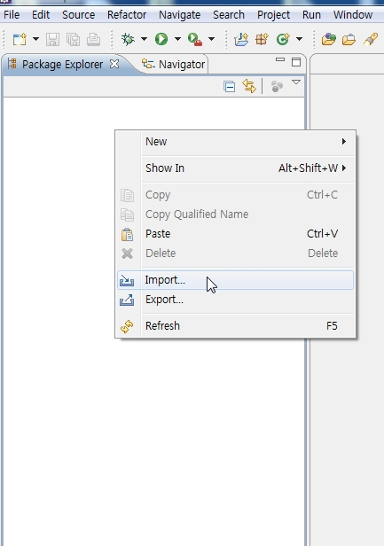
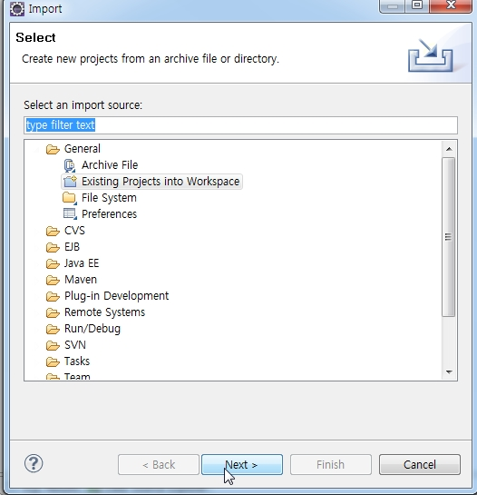
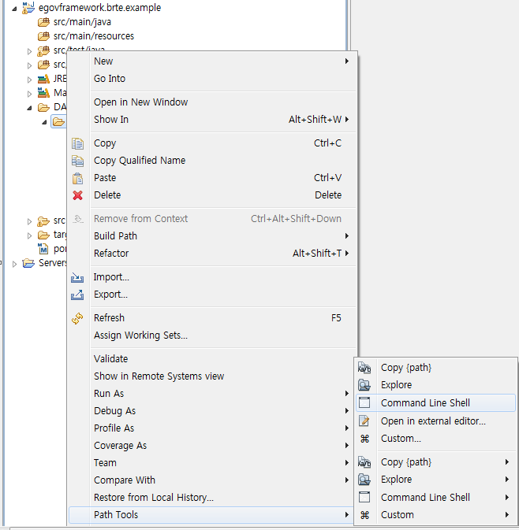
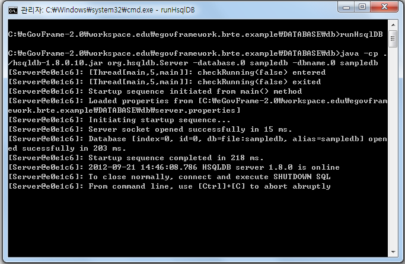
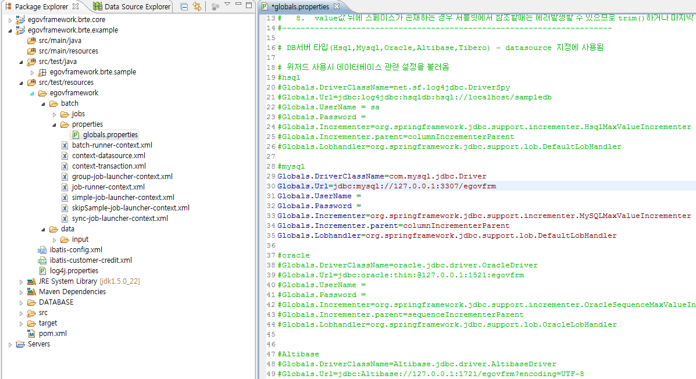
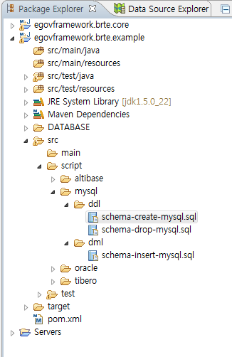

# 배치실행환경 예제 설치법

## 설치 순서
### 기본순서
전자정부 표준프레임워크 홈페이지에서 배치실행환경 소스파일을 다운 받아 압축을 풀고, m2 이클립스가 설치되어 있다는 가정하에 설명한다.

[실행환경 예제 다운로드](http://www.egovframe.go.kr/EgovRunEnvReleaseEdu.jsp?menu=3&submenu=1&leftsub=5)

1. Package Explorer에서 오른쪽 마우스를 클릭하여 소스를 임포트한다.



2. General>Existing Projects into Workspace를 선택하여 압축을 풀어놓은 폴더를 선택한다.



3. 배치실행예제에서는 HSQL DB를 제공하고 있으며 runHsqlDB.cmd 파일을 실행시켜 DB를 기동시킨다.

- egovframework.brte.example\database\db 폴더에서 오른쪽 마우스를 클릭하여 Path Tools>Commands Line Shell을 선택한다.



- 명령프롬프트 창에 runHsqlDB를 입력하여 runHsqlDB.cmd 파일을 실행시킨다.



✔ Path Tools>Commands Line Shell을 선택할 수 없을 경우, 해당 프로젝트의 폴더에서 \database\db아래에 있는 runHsqlDB 파일을 클릭한다.

### HSQL외 DB 연결순서
1. 임포트 된 소스에서 DB정보를 알맞게 바꿔준다. 위치:src/test/resources/egovframework/batch/properties/globals.properties



2. src/script 폴더의 해당 DB의 script 파일을 참고하여 테이블을 생성하고 데이터를 추가한다.



### DB 연결시 주의사항
altibase나 tibero 연결시에는 아래의 설정이 추가로 필요하다.

✔ altibase나 tibero 연결시에는 아래의 파일의 jobRepository 에 databaseType으로 oracle로 추가 설정을 해야 한다.

- batch-runner-context.xml
- group-job-launcher-context.xml
- simple-job-launcher-context.xml
- sync–job-launcher-context.xml

```xml
<bean id="jobRepository" class="org.springframework.batch.core.repository.support.JobRepositoryFactoryBean"
		p:dataSource-ref="dataSource" p:databaseType="oracle" p:transactionManager-ref="transactionManager" p:lobHandler-ref="lobHandler"/>
```

✔ JdbcPagingItemReader의 queryProvider에 databaseType으로 oracle로 추가 설정을 해야 한다.

```xml
<bean id="itemReader" class="org.springframework.batch.item.database.JdbcPagingItemReader" scope="step">
	<property name="dataSource" ref="dataSource" />
	<property name="rowMapper">
		<bean class="egovframework.brte.sample.common.domain.trade.CustomerCreditRowMapper" />
	</property>
       <property name="queryProvider">
		<bean class="org.springframework.batch.item.database.support.SqlPagingQueryProviderFactoryBean">
			<property name="dataSource" ref="dataSource"/>
			<property name="databaseType" value="oracle"/>
			<property name="sortKey" value="ID" />
			<!-- Intentionally put sort key second in the query list as a test -->
			<property name="selectClause" value="select NAME, ID, CREDIT" />
			<property name="fromClause" value="FROM CUSTOMER" />
               </bean>
        </property>
	<property name="pageSize" value="2" />
```

✔ JDBCPagingtEST 할 경우 altibase 버전이 6.1.1일경우에만 정상동작합니다.