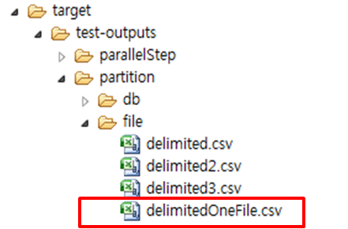

# N:1 파일 Partition 예제

## 설명

### 설정

#### Job 설정

**N:1 Partition 예제의 Job 설정 파일인 partitionFileToOneFileJob.xml을 확인한다.**

- partitioner : 입력리소스 수 만큼 Master Step을 파티셔닝하는 MultiResourcePartitioner
- grid-size : 생성할 Context 수
- writer : scope=“step” 설정 해지로 여러 Slave Step 들이 공유하는 EgovPartitionFlatFileItemWriter 사용(타겟파일이 하나이므로, 다른 파티셔닝과 달리 출력정보를 다루는 EgovOutputFileListener 설정이 필요 없음)

✔ 이 예제는 여러 Slave Step 들이 하나의 Writer를 공유하는 과정에서 Thread Safe 하도록 구성되어 있다

```xml
<job id="partitionJob" restartable="true" xmlns="http://www.springframework.org/schema/batch">		
	<step id="step">
		<partition step="step1" partitioner="partitioner">
			<handler grid-size="4" task-executor="taskExecutor" />
		</partition>
	</step>
</job>
```

```xml
<bean id="partitioner" class="org.springframework.batch.core.partition.support.MultiResourcePartitioner">
	<property name="resources" value="classpath:egovframework/data/input/delimited*.csv" />
</bean>
```

```xml
<step id="step1" xmlns="http://www.springframework.org/schema/batch">
	<tasklet transaction-manager="transactionManager">
		<chunk writer="itemWriterPartition" reader="itemReader commit-interval="3" />
	</tasklet>
</step>
```

```xml
<bean id="itemReader" scope="step" autowire-candidate="false" parent="itemReaderParent">
	<property name="resource" value="#{stepExecutionContext[fileName]}" />
</bean>
<bean id="itemWriterPartition" class="egovframework.brte.sample.example.support.EgovPartitionFlatFileItemWriter">
	<property name="resource" value="file:./target/test-outputs/partition/file/delimitedOneFile.csv" />
	...
</bean>
```

#### 클래스 설정

##### MultiResourcePartitioner

스프링에서 제공하는 MultiResourcePartitioner 를 사용하며 입력리소스의 수(입력파일 수)만큼 Context를 생성하고 출력위치를 셋팅하는 역할을 한다.(Context 생성으로 여러 Slave Step들을 사용할 수 있게 됨)

✔ 이 예제에서 는 File 파티셔닝 예제에서 사용하는 [MultiResourcePartitioner](./batch-example-file_partition.md#multiresourcepartitioner)와 동일하므로 해당부분을 참고한다.

##### EgovOutputFileListener

Step 수행 이전에 호출이 되며, 입력리소스의 정보를 이용하여 출력파일에 대한 정보를 생성 및 저장한다.  

✔ 출력은 path의 기본값인 “file:./target/output/” 이하에 생성이 되며, 이 경로는 Job 설정파일(path 프로퍼티)에서 변경할 수 있다.

### JunitTest 구성 및 수행

#### JunitTest 구성

**partitionFileToOneFileJob 설정과 관련 클래스들로 Junit Test를 수행한다. 이 때 배치가 수행되고, 관련된 내용을 확인할 수 있다.**

✔ JunitTest 클래스의 구조는 [배치실행환경 예제 Junit Test 설명](./batch-example-run_junit_test.md)을 참고한다.   
✔ assertEquals(“COMPLETED”, jobExecution.getExitStatus().getExitCode()) : 배치수행결과가 COMPLETED 인지 확인한다.  
✔ 데이터처리 결과를 확인하기 위해, 배치수행과 개별적으로 여러 입력파일의 데이터 합과 단일 출력파일의 데이터 합을 비교하여 정상수행여부를 판단한다.  

```java
@Test
public void testUpdateCredit() throws Exception {
	...
	open(inputReader);
	List<CustomerCredit> inputs = new ArrayList<CustomerCredit>(getCredits(inputReader));
	close(inputReader);
 
	JobExecution jobExecution = jobLauncherTestUtils.launchJob();
	assertEquals(BatchStatus.COMPLETED, jobExecution.getStatus());
 
	@SuppressWarnings("unchecked")
	ItemReader<CustomerCredit> outputReader = (ItemReader<CustomerCredit>) applicationContext.getBean("outputTestReader");
	open(outputReader);
	List<CustomerCredit> outputs = new ArrayList<CustomerCredit>(getCredits(outputReader));
	close(outputReader);
 
	// inputFile 과 outputFile 에 포함된 line 수 비교
	assertEquals(inputs.size(), outputs.size());
	// inputFile 과 outputFile 에 포함된 모든 credit 의 합을 비교
	int inputCredit=0;
	int outputCredit=0;
 
	//input 파일들에서 Credit 의 합
	inputs.iterator();
	for (int i = 0; i < inputs.size(); i++) {
		inputCredit += inputs.get(i).getCredit().intValue();
	}
 
	//output 파일들에서 Credit 의 합
	for (int j = 0; j <  outputs.size(); j++) {
		outputCredit += outputs.get(j).getCredit().intValue();
	}
 
	assertEquals(inputCredit, outputCredit);
}
```

#### JunitTest 수행

수행방법은 [JunitTest 실행](https://www.egovframe.go.kr/wiki/doku.php?id=egovframework:dev2:tst:test_case)을 참고한다.


### 결과확인

생성된 파일의 결과를 확인한다.
배치 수행 결과, 세개의 입력파일을 읽고 처리하여 하나의 파일에 쓰여진 것을 확인할 수 있다.




