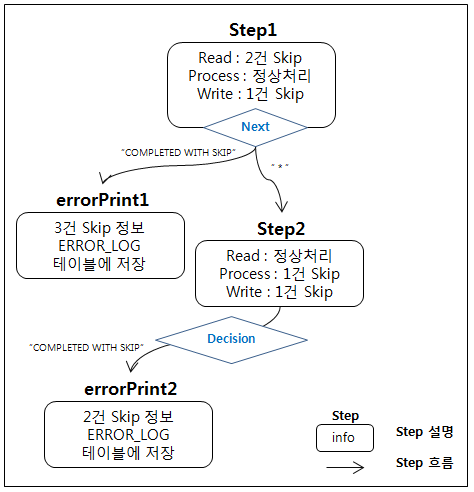
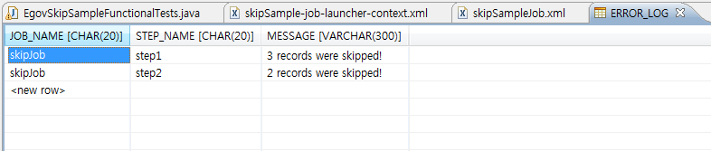

# 건너뛰기(Skip) 기능 예제

## 개요
배치 수행 중, 데이터를 처리하는 과정에서 에러가 발생한 데이터를 건너뛰고 다음 데이터를 처리하는 기능을 보여주는 예제이다. EgovSkipSampleFunctionalTests 예제는 ItemReading,ItemProcessing, ItemWriting 에서 발생한 예외상황에 대해 정해진 설정대로 Skip을 수행되는 과정을 보여준다.

## 설명
###  설정
####  Job 설정
<b>건너뛰기(Skip) 기능 예제의 Job 설정 파일인 skipSample.xml을 확인한다.</b>

✔ skipSample의 Step 흐름 참고



Job 의 구성을 보면 Chunk 설정에 아래와 같은 설정이 있다.
- skip-limit : Skip 할 수 있는 최대 횟수를 지정한다.
- \<skippable-exception-classes\> : Exception 범위를 지정한다.

```
  <include> : skip 해야하는 Exception 지정
  <exclude> : include로 지정한 exception의 하위 exception 중, skip 하지 않을 Exception 지정
```

```xml
<job id="skipJob" incrementer="incrementer" xmlns="http://www.springframework.org/schema/batch">
       <step id="step1" parent="baseStep">
		<tasklet>
			<chunk reader="fileItemReader" processor="tradeProcessor" writer="tradeWriter" 
				commit-interval="3" skip-limit="10">
				<skippable-exception-classes>
					<include class="org.springframework.batch.item.file.FlatFileParseException" />
		  			<include class="org.springframework.batch.item.WriteFailedException" /> 
				</skippable-exception-classes>
			</chunk>
		</tasklet>		
		<next on="*" to="step2" />
		<next on="COMPLETED WITH SKIPS" to="errorPrint1" />
		<fail on="FAILED" exit-code="FAILED" />
	</step>
	<step id="errorPrint1" next="step2">
		<tasklet ref="errorLogTasklet" />
	</step> 
	<step id="step2" parent="baseStep" next="skipCheckingDecision">
		<tasklet>
			<chunk reader="tradeSqlItemReader" processor="tradeProcessorFailure" writer="itemTrackingWriter" 
				commit-interval="2" skip-limit="10">
				<skippable-exception-classes merge="true">
					<include class="org.springframework.batch.item.validator.ValidationException" />
					<include class="java.io.IOException" />
				</skippable-exception-classes>
			</chunk>
			<no-rollback-exception-classes>
				<include class="org.springframework.batch.item.validator.ValidationException" />
			</no-rollback-exception-classes>
		</tasklet>
	</step>
	<decision id="skipCheckingDecision" decider="skipCheckingDecider">
		<end on="*" />
		<next on="COMPLETED WITH SKIPS" to="errorPrint2" />
		<fail on="FAILED" exit-code="FAILED" />
	</decision>
	<step id="errorPrint2">
		<tasklet ref="errorLogTasklet" /> 
	</step>
</job>
```

### JunitTest 구성 및 수행
#### JunitTest 구성
<b>simple-job-launcher-context.xml 설정과 skipSample.xml 설정으로 이루어진 Junit Test를 수행한다. 이 때 배치가 수행되고, 관련된 내용을 확인할 수 있다.</b>

✔ JunitTest 클래스의 구조는 [배치실행환경 예제 Junit Test 설명](./batch-example-run_junit_test.md)을 참고한다.

✔ assertEquals(“COMPLETED”, jobExecution.getExitStatus().getExitCode()) : 배치수행결과가 COMPLETED 인지 확인한다.

✔ 다음 Tests 클래스의 주석을 참고하여 Step의 흐름에 따라 Skip이 일어나는 과정을 확인한다.

```java
@ContextConfiguration(locations = {"/egovframework/batch/simple-job-launcher-context.xml",
		"/egovframework/batch/jobs/skipSampleJob.xml",
		"/egovframework/batch/job-runner-context.xml" })
public class EgovSkipSampleFunctionalTests {    ...
	@Test
	public void testJobIncrementing() {
		...		
		JobExecution execution1 = jobExplorer.getJobExecution(id1);
		assertEquals(BatchStatus.COMPLETED, execution1.getStatus());
 
		validateLaunchWithSkips(execution1);
	}
 
	private void validateLaunchWithSkips(JobExecution jobExecution) {
 
		// Step1: 10 input 레코드, READ 에서 2건 SKIP (ROW:5,10), WRITE 1 건 SKIP => OUTPUT 결과 7건
		assertEquals(7, SimpleJdbcTestUtils.countRowsInTable(simpleJdbcTemplate, "TRADE"));
 
		// Step2: 7 input 레코드, PROCESS 에서 1건 SKIP, WRITE에서 1건 SKIP => OUTPUT 결과 5건
		assertEquals(5, simpleJdbcTemplate.queryForInt("SELECT COUNT(*) from TRADE where VERSION=?", 1));
 
		// 두번째 스텝에서 1건의 SKIP 발생
		assertEquals(1, EgovSkipCheckingListener.getProcessSkips());
 
		// 두 스텝 모두 ERROR_LOG 테이블에 정보 찍힘
		assertEquals(2, SimpleJdbcTestUtils.countRowsInTable(simpleJdbcTemplate, "ERROR_LOG"));
 
		//Step1 에서 3건 SKIP 되었다는 정보 확인
		assertEquals("3 records were skipped!", simpleJdbcTemplate.queryForObject(
				"SELECT MESSAGE from ERROR_LOG where JOB_NAME = ? and STEP_NAME = ?", String.class, "skipJob", "step1"));
 
		//Step2 에서 2건 SKIP 되었다는 정보 확인
		assertEquals("2 records were skipped!", simpleJdbcTemplate.queryForObject(
				"SELECT MESSAGE from ERROR_LOG where JOB_NAME = ? and STEP_NAME = ?", String.class, "skipJob", "step2"));
 
	}
}
```

#### JunitTest 수행
수행방법은 [JunitTest 실행](https://www.egovframe.go.kr/wiki/doku.php?id=egovframework:dev2:tst:test_case)을 참고한다.

### 결과확인
EgovErrorLogTasklet 에서 처리된 Skip에 대한 간단한 정보를 ERROR_LOG 테이블에서 확인할 수 있다.



## 참고자료
- [Retry](../../../egovframe-runtime/batch-layer/batch-core-skip_repeat_retry.md)