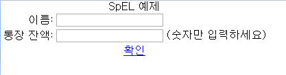
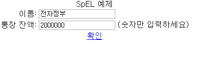
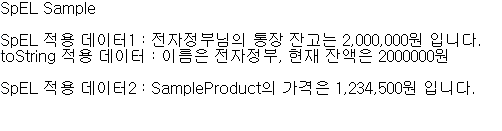

# SpEL 예제(Spring Expression Language Example)

## 개요

Spring 3.0에 새롭게 추가된 SPeL 지원기능을 이용하여, JSP 파일상에서 Spring Expression Language를 사용하는 기능에 대한 예제를 제공한다. 이 예제에서는 입력된 데이터 값에 대하여 SPeL의 출력값 포맷팅 기능을 활용하여 출력값을 형식에 맞게 화면에 표시해주는 기능을 제공한다.

## 설명

```
1. 해당 예제를 실행하면 아래와 같은 예제페이지가 호출된다.
```

  

```
2. 이름란과 통장 잔액란에 각각 이름과 잔액을 입력하고 [확인]을 누른다.
```

  

```
3. SpEL을 적용하여 포맷팅을 적용한 값이 출력된다.
```

  

## 참고자료
- [SpEL 가이드](../../../egovframe-runtime/foundation-layer-core/spel.md)
