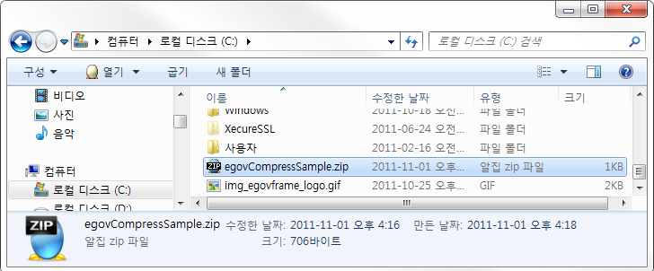
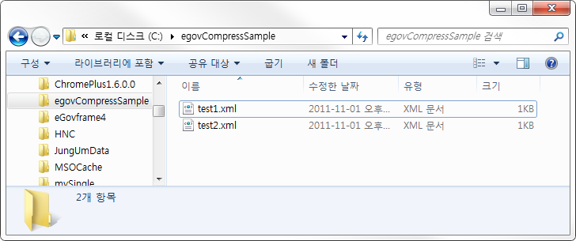

# 압축/압축해제 예제(Compress/Decompress Example)

## 개요
전자정부 표준프레임워크 상에서 서버상에 존재하는 특정 파일을 압축하거나 압축 해제하는 기능에 대한 예제를 제공한다. 서버상에서 지정된 파일을 zip 파일로 압축하고, 이를 다시 압축 해제하는 기능을 controller 상에서 수행하는 기능을 제공한다.

## 설명
1. 해당 예제를 실행하고 성공메세지를 확인한다.

2. 실행에 성공하면 테스트파일을 압축해 C:\egovCompressSample.zip 형태로 압축된다.

3. [압축해제]를 누르고 성공메세지를 확인한다.

4. 압축해제가 성공하면 C:\egovCompressSample폴더에 압축해제된 파일이 생성되어 있다.

## 참고자료
- [Compress/Decompress 서비스](../../../egovframe-runtime/foundation-layer/compress-decompress.md)