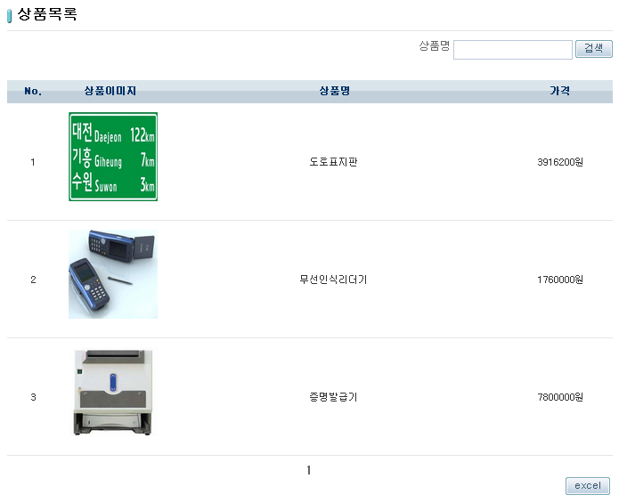
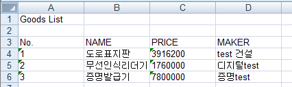

# 엑셀 예제(Excel Example)

## 개요
데이터베이스에 저장된 내용을 화면에 출력하고, 해당 내용을 엑셀 파일로 내보내는 기능에 대한 예제이다. 사용자는 주어진 목록을 엑셀파일 형태로 다운로드 받을 수 있으며, 개발자는 엑셀 템플릿 형태로 양식을 정의하고 이에 맞추어서 데이터를 추가할 수 있다.

## 설명
1. 해당 예제를 설치하고 실행하면 상품목록 페이지가 호출된다.

2. [excel] 버튼을 누르면 상품목록을 excel파일로 다운받을 수 있다.

## 참고자료
-  [Excel 서비스](../../../egovframe-runtime/foundation-layer/excel.md)