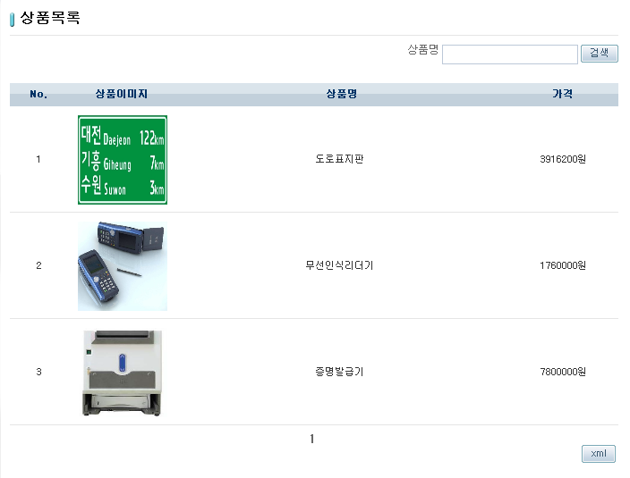
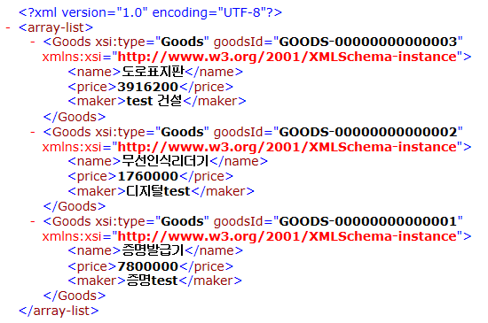

# OXM 예제(OXM Example)

## 개요
객체와 XML간의 Mapping을 이용하는 Object-XML Mapping (OXM) 기능에 대한 예제를 제공한다. 이 예제는 주어진 데이터를 XML으로 변화하여 사용자에게 제공하며, 사용자는 브라우저를 통하여 해당하는 XML 파일을 확인할 수 있다.

## 설명
1. 해당 예제를 설치하고 실행하면 상품목록 페이지가 호출된다.

2. [xml] 버튼을 누르면 상품목록을 XML파일로 다운받을 수 있다.

## 참고자료
- [Marshalling/Unmarshalling 가이드](../../../egovframe-runtime/foundation-layer/marshalling-unmarshalling.md)