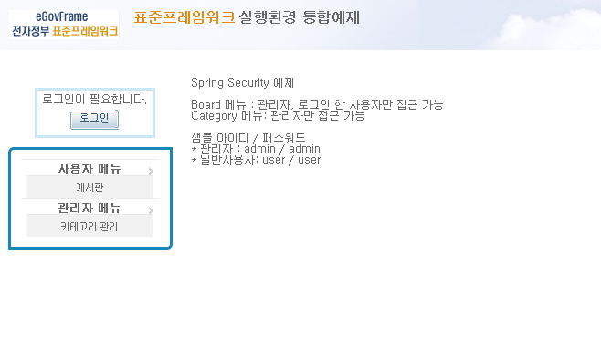
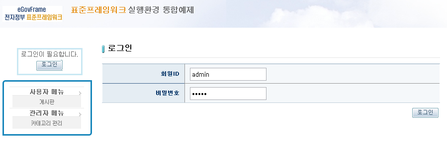
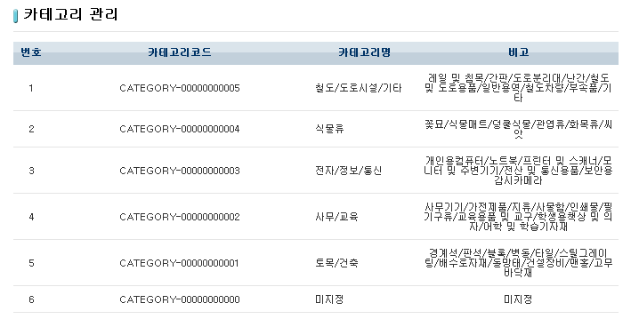
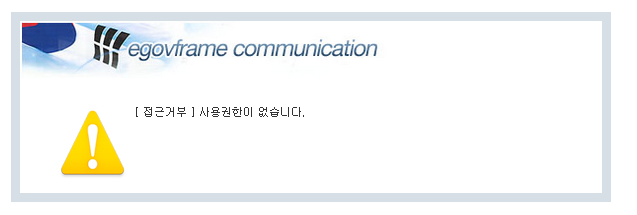

# 스프링 시큐리티 예제(Spring Security Example)

## 개요
Spring Security를 이용하여 로그인, 보안, 권한관리를 수행하는 기능에 대한 예제이다. 사용자의 로그인 및 권한 관리, 각 페이지에 대한 접근 및 출력 내용에 대한 통제등을 Spring Security 2.0.4를 이용하여 수행하며, 이에 대한 예제 기능을 제공한다.

## 설명
1. 해당 예제를 실행하면 로그인이 가능한 페이지가 호출된다.

2. [로그인] 버튼을 누르고 메인에 표시된 관리자 아이디와 패스워드를 이용하여 로그인한다.

3. 환영메세지가 출력되고 게시판과 카테고리 관리에 접근이 가능하다.

4. 로그인 하지않았거나 일반사용자 아이디로 로그인한 후 카테고리 관리에 접근하게 되면 미리 정의한 에러 페이지가 출력된다.

## 참고자료
- [Server Security](../../../egovframe-runtime/foundation-layer/server-security.md)
  - [Architecture](../../../egovframe-runtime/foundation-layer/server-security-architecture.md)
  - [Authentication](../../../egovframe-runtime/foundation-layer/server-security-authentication.md)
  - [Authorization](../../../egovframe-runtime/foundation-layer/server-security-authorization.md)
