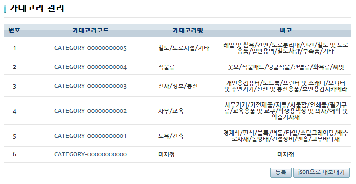
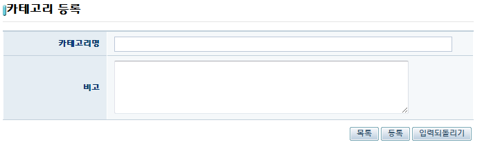
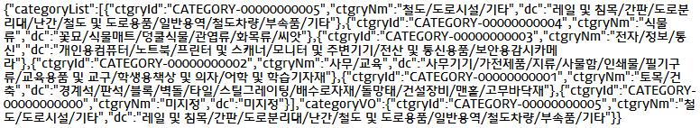
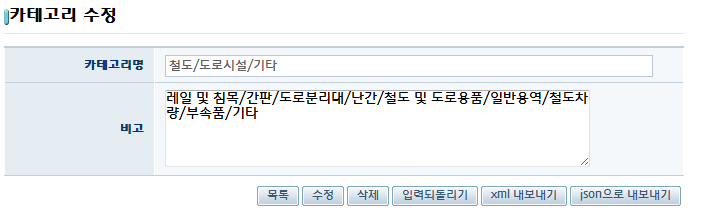
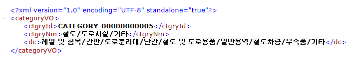

# Restful 웹서비스 예제(Restful Web Service Example)

## 개요

Spring 3.0에서 새롭게 추가된 Restful 웹서비스 지원기능을 이용하여 주어진 데이터를 Restful 요청/응답을 통하여 화면 또는 각 파일 양식으로 출력시켜주는 기능의 예제이다. URL을 통하여 각 카테고리의 목록 또는 상세정보를 요청할 수 있으며, HTML, JSON, XML 형태의 출력을 지원한다.

## 설명

```
1. 해당 예제를 실행하면 Restful 웹서비스기능을 이용한 카테고리 관리페이지를 볼 수 있다. 
```



```
2. [등록] 버튼을 누르면 카테고리 등록페이지를 호출하고 카테고리 등록이 가능하다.
```



```
3. 카테고리 관리페이지에서 [json으로 내보내기]버튼을 누르면 JSON형태로 카테고리목록을 출력한다.
```



```
4. 카테코리 코드를 클릭하면 카테고리 수정페이지를 호출한다.
```



```
5. 카테고리 수정페이지에서 [xml 내보내기]를 클릭하면  XML형태로 카테고리를 출력한다.
```



## 참고자료

- [Restful 가이드](../../../egovframe-runtime/integration-layer/restful.md)