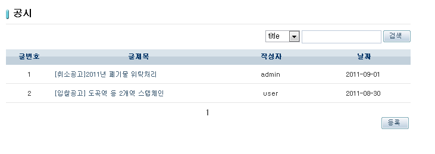
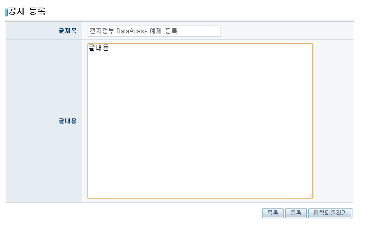
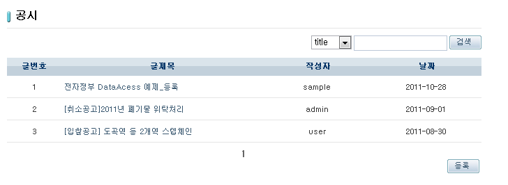
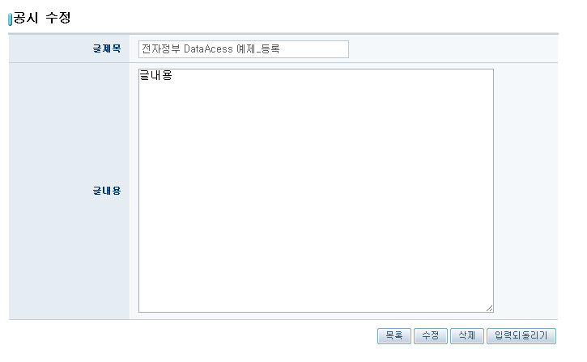

# 데이터 엑세스 예제(Data Access Example)

## 개요
iBatis를 사용하여 Database에 데이터를 조회, 생성, 수정, 삭제하는 기능에 대한 예제를 제공한다. SQL Mapping을 통하여 쿼리 및 데이터 매핑을 정의하고, 스프링의 Data Source를 사용하여 Connection을 획득한 뒤, DAO 클래스에서 주어진 메소드를 사용하여 CRUD 작업을 수행한다. 조회 결과를 화면에 출력하거나 화면에서 작성된 입력 내용을 데이터베이스에 반영하는 기능의 예제를 제공한다.

## 설명
1. 해당 예제를 설치하고 실행하면 iBatis로 구현한 공시게시판이 나타난다.

2. [등록] 버튼을 눌러 공시 등록페이지를 호출하고, 내용을 작성한다.

3. 공시 등록페이지의 [등록] 버튼을 누르면 글이 등록되고, 공시게시판으로 돌아간다.

4. 해당글을 눌러 수정과 삭제를 할 수 있다.

## 참고 자료
- [Data Access - iBatis](../../../egovframe-runtime/persistence-layer/dataaccess-ibatis.md)