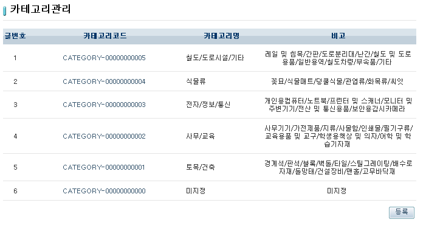
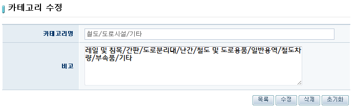

# ORM 예제(ORM Example)

## 개요
Hibernate를 사용한 ORM 기능의 예제를 제공한다. 별도의 쿼리문을 정의하지 않고, 객체와 테이블간의 Mapping을 정의하여 순수 자바 코드를 사용하여 자료의 조회, 생성, 수정, 삭제를 수행하는 기능을 제공한다. 일반적인 게시판 형식의 예제이지만 Hibernate를 활용하여 데이터의 입출력이 어떻게 이루어지는지 확인할 수 있다.

## 설명
1. 해당 예제를 설치하고 실행하면 Hibernate를 사용한 카테고리관리 페이지가 나타난다.

2. [등록] 버튼을 눌러 카테고리 등록 페이지를 호출하여 카테고리를 등록 할 수 있다.

3. 등록된 카테고리코드를 클릭하여 카테고리를 수정하거나 삭제할 수 있다.

## 참고 자료
- [ORM](../../../egovframe-runtime/persistence-layer/orm.md)