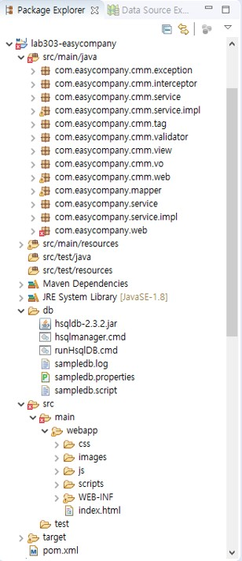
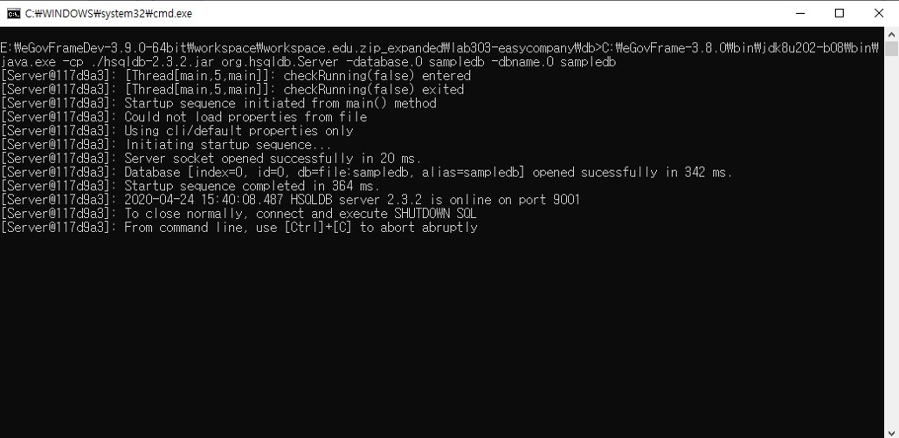
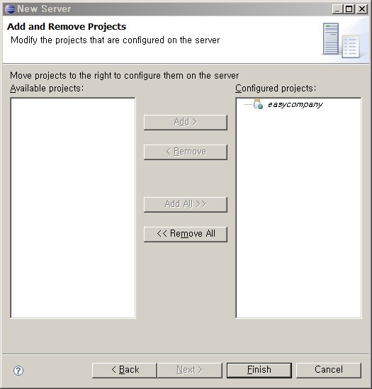
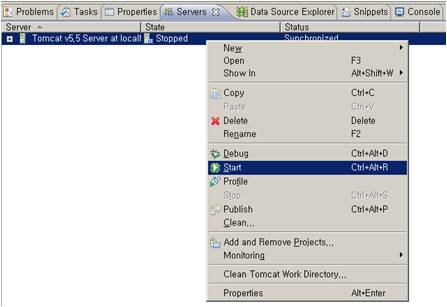

# easycompany 예제 실행하기

## 개요

EasyCompany 예제는 MVC와 Ajax Support, Security의 예제 코드로서, JDK 1.8, Eclipse 4.8.0, Tomcat 8.0, HSQLDB 2.3.2 환경에서 실행된다. 사원 리스트 페이지 확인은 SVN에서 프로젝트를 다운받아 DBMS(runHsqlDB.cmd)와 Tomcat을 실행 후 http://localhost:8080/easycompany 에 접속해 id/pwd: 1/1로 로그인하면 가능하다.

## 개발환경

- JDK : JDK 1.8
- Eclipse : 4.8.0
- Web Container : Tomcat 8.0
- DBMS : HSQLDB 2.3.2

## 설치

1. SVN에서 예제 코드 easycompany 프로젝트를 다운 받습니다.  
이클립스에서 해당 프로젝트를 보면 아래와 같은 구조를 가지고 있습니다.  

**src/ : 자바 클래스**  
- com.easycompany.controller.annotation: @Controller
- com.easycompany.controller.hierachy: 계층형 Controller
- com.easycompany.dao: DAO 클래스, SQL Map 파일
- com.easycompany.domain: 폼클래스, JavaBeans
- com.easycompany.interceptor: 선후처리를 위한 Interceptor
- com.easycompany.service: 서비스 클래스들
- com.easycompany.tag: 페이징을 위한 태그 클래스
- com.easycompany.validator: 유효성 검증을 위한 spring validator
- com.easycompany.view: View 클래스

**db/: 샘플 구동을 위한 데이터 생성, DBMS 실행**  
- runHsqlDB.cmd : dbms 실행은 이 파일을 실행시킵니다.
- sampledb.script : 샘플을 실행하기 위한 SQL.

**webapp/**  
- WEB-INF/jsp: jsp 파일들.
- WEB-INF/lib: 참조 라이브러리 WEB-INF/config : 스프링등의 설정 파일.
- easycompany-dao.xml - DataSource, iBatis 설정등 퍼시스턴스 레이어 관련 설정.
- easycompany-service.xml - 비즈니스 레이어 관련 설정.
- easycompany-servlet.xml - 프리젠테이션 레이어 설정. @Controller
- easycompany-servlet-old.xml - 프리젠테이션 레이어 설정. 계층형 Controller
- validator.xml , validator-rules.xml-Jakarta Commons Validator를 이용한 validation 설정 파일.

2. DBMS 실행  
easycompany\db에 있는 runHsqlDB.cmd을 실행합니다.  
샘플 실행에 필요한 데이터들도 이때 같이 생성됩니다.

3. Tomcat 실행  
이클립스에서 easycompany 프로젝트를 clean 한 번 실행해 주신 다음,
Server 탭에서 새로운 서버를 추가하시고 아래와 같이 easycompany 프로젝트를 추가해 주세요.

4. 브라우져에서 확인  
브라우져 주소창에 http://localhost:8080/easycompany 입력한 후 로그인 페이지에서 id/pwd : 1/1 을 입력한다.  
사원리스트 페이지가 나타나면 성공.