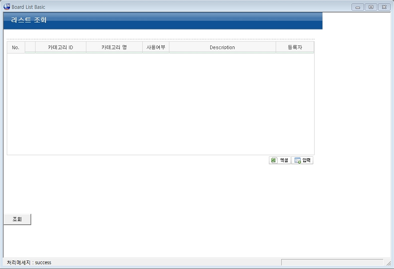
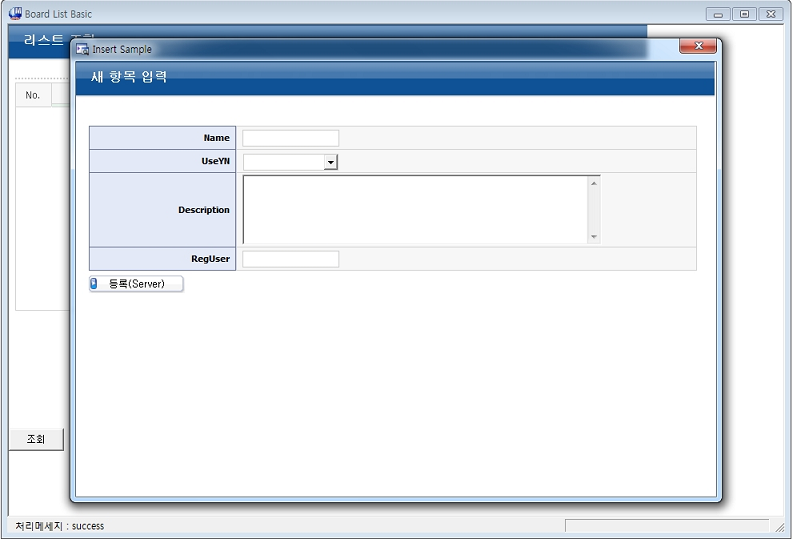
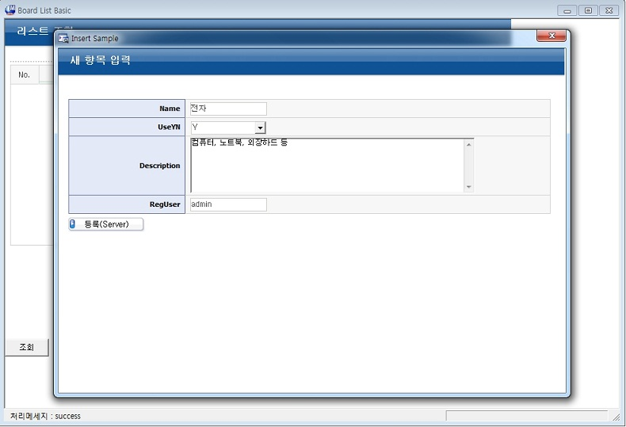
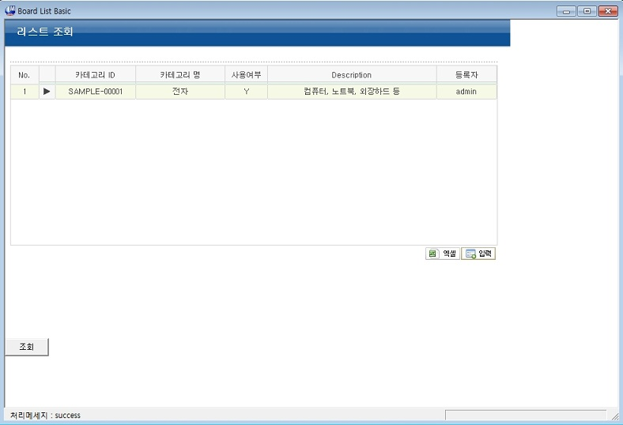
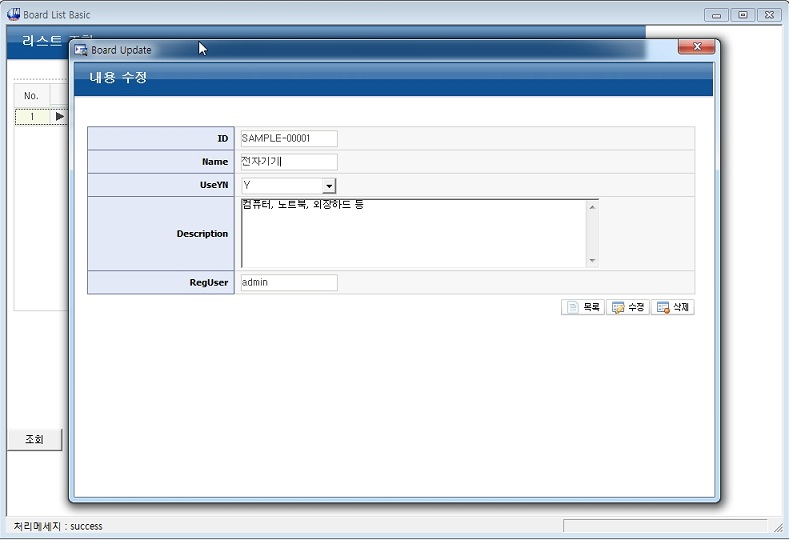
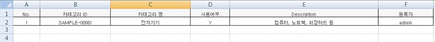

# UI 어댑터 예제(UI Adapter Example)

## 개요

외부 UI 도구를 표준프레임워크에 활용하기 위하여 데이터를 주고 받기 위한 UI 어댑터에 대한 예제이다. 이 예제는 MiPlatform을 이용하여 화면을 구성하고 전자정부 표준프레임워크를 활용하여 해당 화면을 연결하여 기초적인 CRUD 작업을 수행하는 기능을 제공한다.

## 설명

## 참고자료