# 설치법

## 설치 순서

- 기본순서

 전자정부 표준프레임워크 홈페이지에서 소스파일을 다운 받아 압축을 풀고, m2 이클립스가 설치되어 있다는 가정하에 설명한다.

```bash
1. Package Explorer에서 오른쪽 마우스를 클릭하여 소스를 임포트한다.
```

 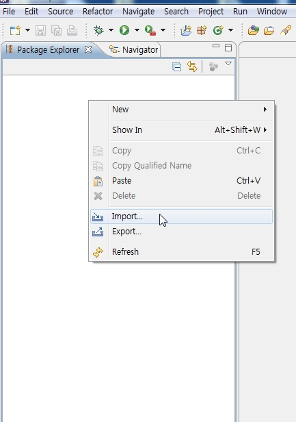

```bash
2. General > Existing Project into Workspace를 선택하여 압축을 풀어놓은 폴더를 선택한다.
```

 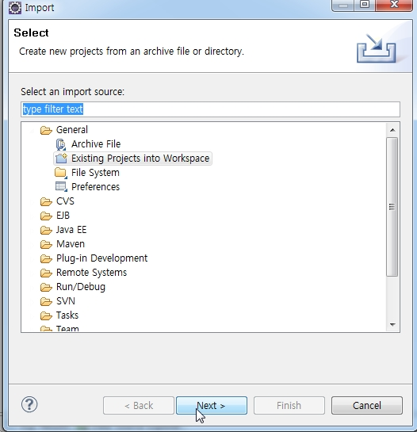

```bash
3. 임포드 된 소스에서 DB정보를 알맞게 바꿔준다. 위치:src/main/resources/egovframework/property/globals.properties
```

 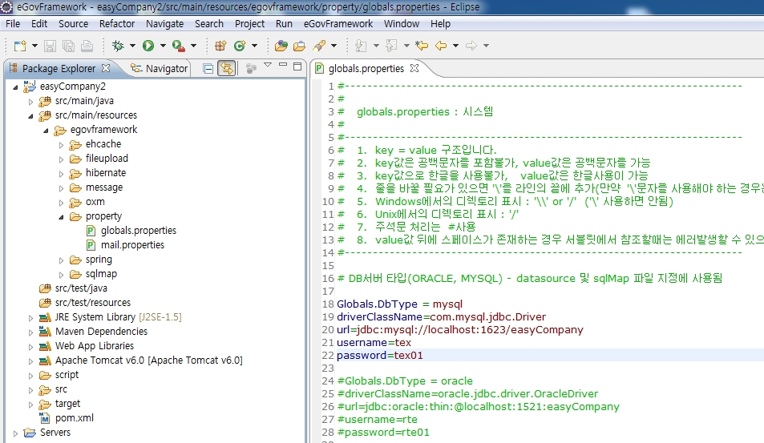

```bash
4. script 폴더의 script, data 파일을 참고하여 테이블을 생성한다.
```

 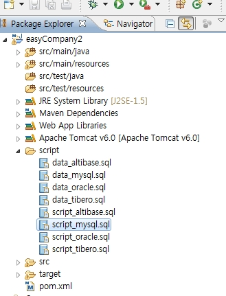

```bash
5. 프로젝트를 실행시킨다. (오른쪽마우스 클릭 > Run As > Run On Server)
```

 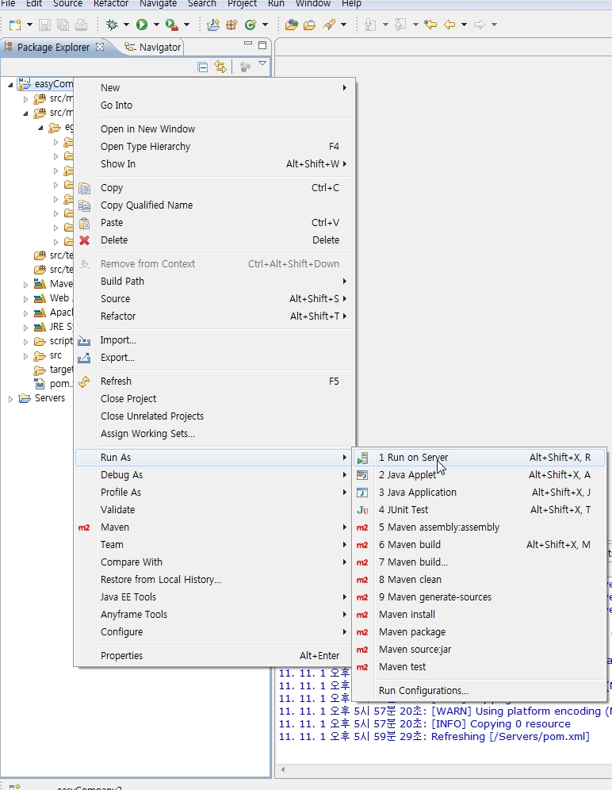

```bash
6. 설치된 톰캣 버전을 선택하고 next 또는 finish를 클릭하여 프로젝트를 실행한다.
```

 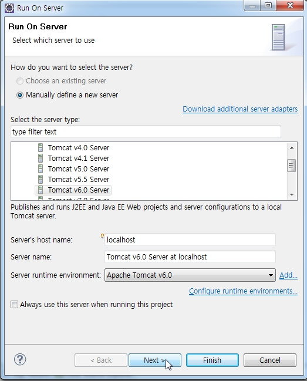

## 오류 발생 시 대처 순서

 기본 순서 절차처럼 실행시 오류가 날 경우 대처 순서를 설명한다.

```bash
1. Maven의 설정을 초기화 한다.(Maven > Update Project Configration)
```

 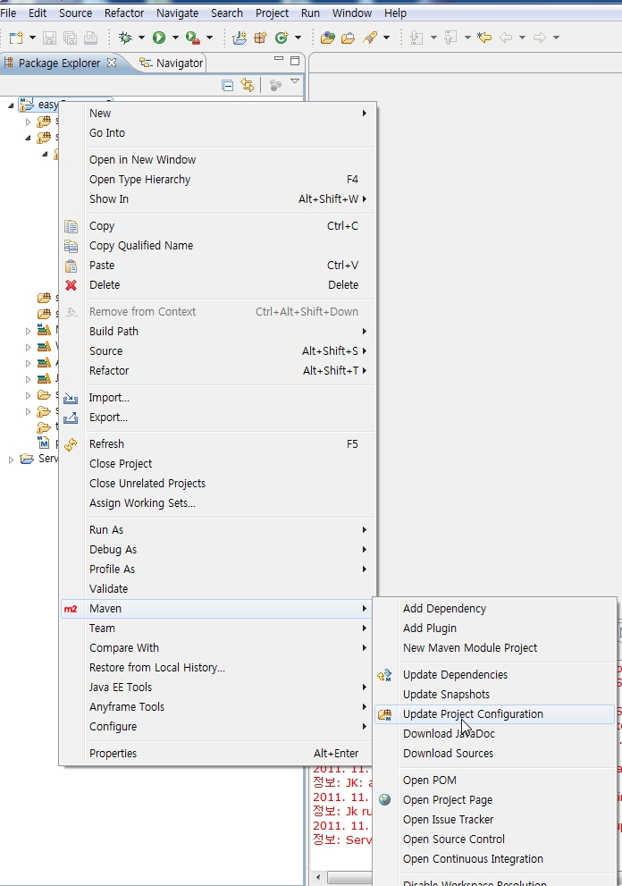

```bash
2. Dependency 파일을 다시한번 인스톨 한다. (Run As > Maven Install)
```

 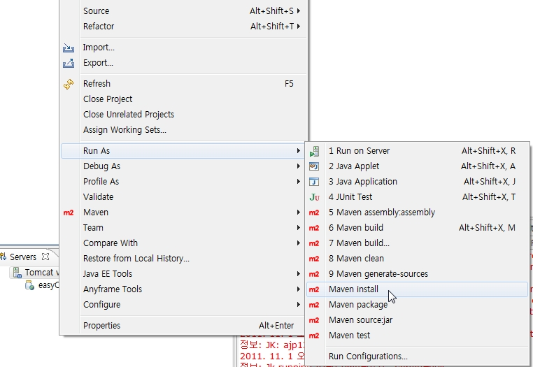

```bash
3. 콘솔 창의 Build Success를 확인한다.
```

 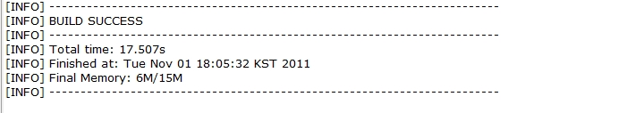

```bash
4. maven을 초기화 할 경우, .classpath파일이 자동으로 변경되는 경우가 있다.
```

 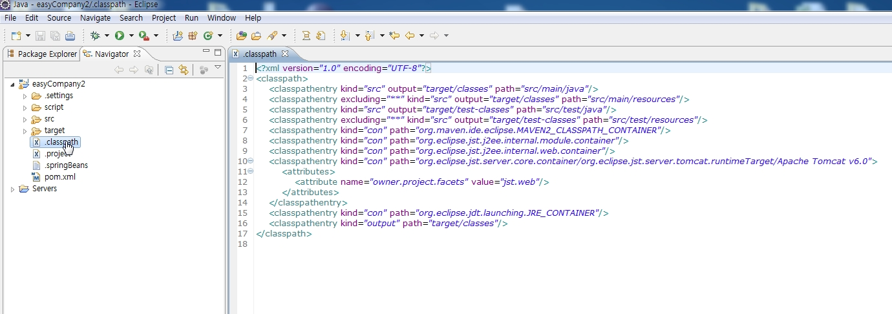

```bash
5.  .classpath를 살펴보고 아래와 같이 변경한다.
```

 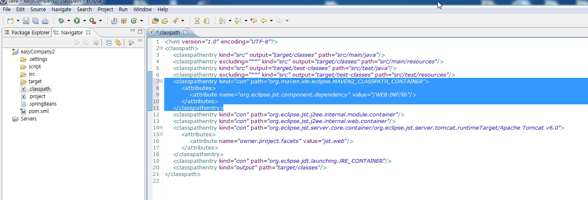