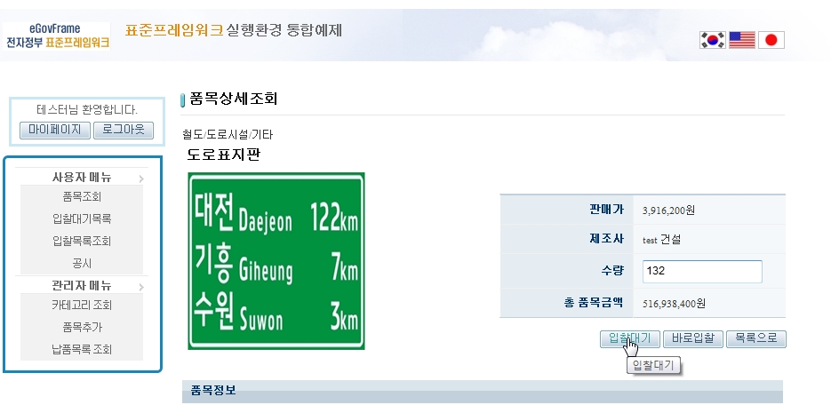
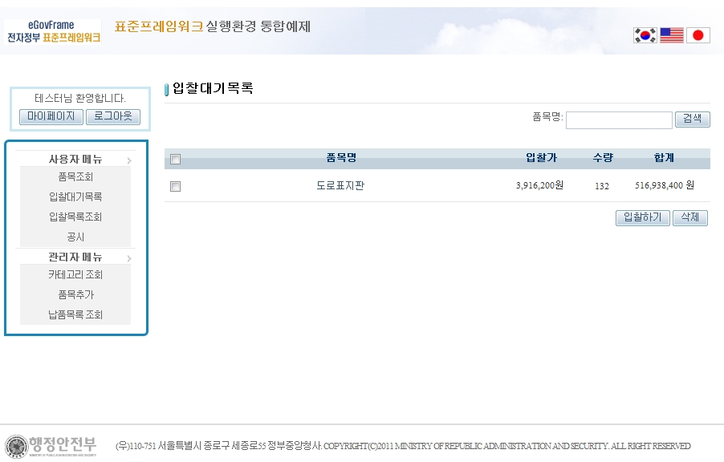
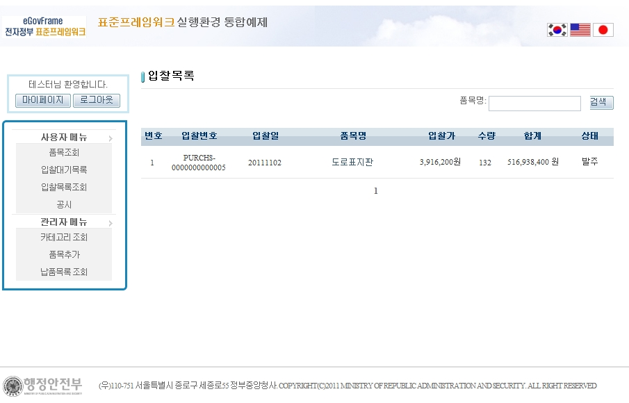
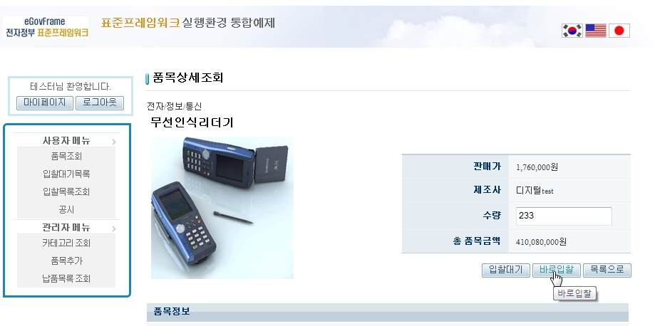

# 입찰 관리

## 설명

 회원은 품목을 입찰 할 수 있으며, 입찰 전 입찰 대기 목록에 저장 할 수 있다. 입찰한 품목에 한하여 상태를 확인 할 수 있다.

```bash
1. 입찰 할 품목을 선택하여 수량을 입력하고 [입찰대기]버튼을 클릭한다.
```

 

```bash
2. 사용자 메뉴의 [입찰대기목록]을 선택하면 입찰 대기 중인 품목이 출력된다. 입찰 할 품목을 체크한 후 [입찰하기]버튼을 클릭하면 입찰 할 수 있다.
```

 

```bash
3. 사용자 메뉴의 [입찰목록]을 선택하면 입찰한 품목이 출력되며 상태가 확인 가능하다.
```

 

```bash
4. 입찰대기 목록을 거치지 않고 바로 입찰할 경우, 품목 수량 입력 후 [바로입찰]을 클릭한다.
```

 

## 참고자료

- [SpEL](https://www.egovframe.go.kr/wiki/doku.php?id=egovframework:rte2:ptl:spel)
- [Internationalization(국제화)](https://www.egovframe.go.kr/wiki/doku.php?id=egovframework:rte2:ptl:internationalization)
- [Data Access](https://www.egovframe.go.kr/wiki/doku.php?id=egovframework:rte2:psl:data_access)
- [ID Generation](https://www.egovframe.go.kr/wiki/doku.php?id=egovframework:rte2:fdl:id_generation)
- [Property](https://www.egovframe.go.kr/wiki/doku.php?id=egovframework:rte2:fdl:property)