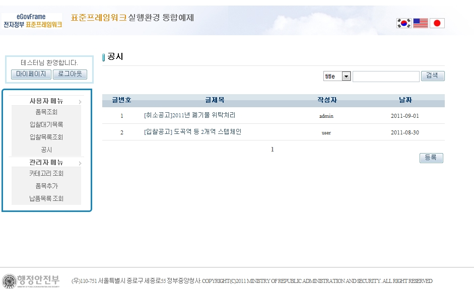
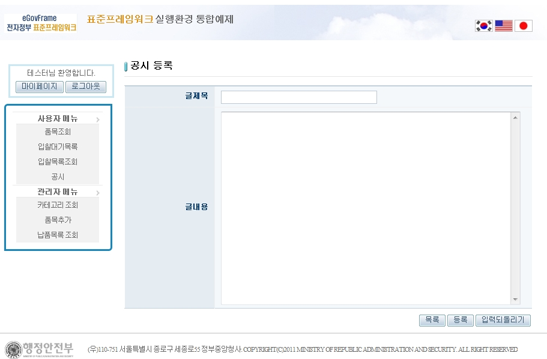
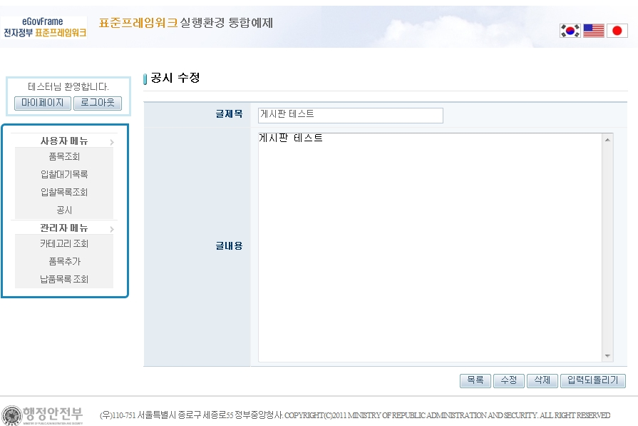
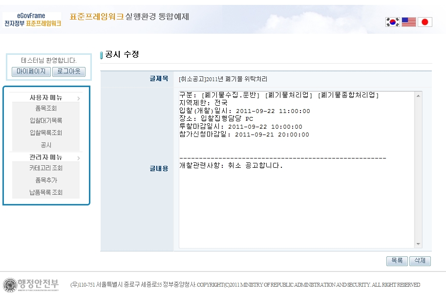

# 게시판 관리

## 설명

 가장 기본적인 기능으로 글을 등록, 수정, 삭제, 검색 하는 기능이 있다. 관리자의 경우 모든 글을 삭제할 수 있는 권한이 있다.

```bash
1. 메뉴에서 [공시]를 선택하여 게시글 목록을 확인한다.
```

 

```bash
2. [등록]버튼을 클릭 후, 글제목과 글내용을 입력하여 글을 등록한다.
```

 

```bash
3. 등록한 글 중 수정할 글을 선택하면, 다음과 같이 수정, 삭제가 가능하다.
```

 

```bash
4. 관리자의 경우, 다른 회원이 작성한 글에 대해 삭제 권한을 갖는다.
```

 

## 참고자료

- [validation](https://www.egovframe.go.kr/wiki/doku.php?id=egovframework:rte2:ptl:validation)
- [Security](https://www.egovframe.go.kr/wiki/doku.php?id=egovframework:rte2:ptl:security)
- [Cache](https://www.egovframe.go.kr/wiki/doku.php?id=egovframework:rte2:fdl:cache)
- [SpEL](https://www.egovframe.go.kr/wiki/doku.php?id=egovframework:rte2:ptl:spel)
- [Internationalization(국제화)](https://www.egovframe.go.kr/wiki/doku.php?id=egovframework:rte2:ptl:internationalization)
- [Data Access](https://www.egovframe.go.kr/wiki/doku.php?id=egovframework:rte2:psl:data_access)
- [ID Generation](https://www.egovframe.go.kr/wiki/doku.php?id=egovframework:rte2:fdl:id_generation)
- [Property](https://www.egovframe.go.kr/wiki/doku.php?id=egovframework:rte2:fdl:property)