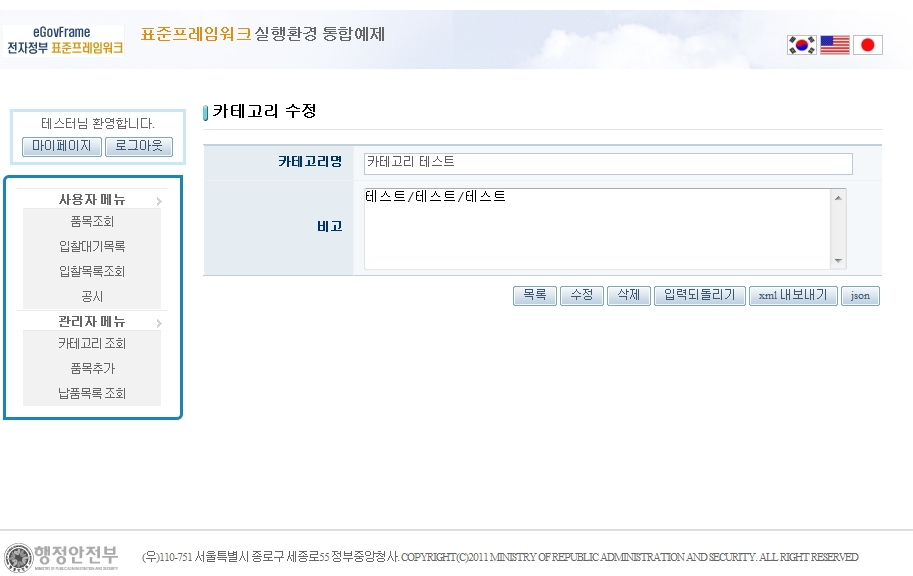
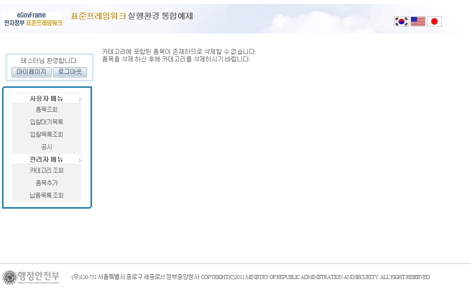

# 카테고리 관리

## 설명

 카테고리를 등록, 수정, 삭제할 수 있는 기능으로 관리자만 접근 가능하다. Restful을 사용하였으며, xml, json으로 화면 출력이 가능하다.

```bash
1. 관리자로 로그인 하고, 메뉴에서 [카테고리 조회]를 선택한다. 현재 목록을 json으로 출력 가능하다.
```

 

```bash
2. 목록 페이지에서 [등록]버튼을 클릭한 후, 카테고리명과 비고을 입력하고 [등록] 버튼을 클릭한다.
```

 

```bash
3. 등록한 카테고리 중 수정할 카테고리를 선택하면, 다음과 같이 수정, 삭제가 가능하다.
```

 

```bash
4. 카테고리 정보를 xml과 json으로 출력가능하며, 다음은 xml 화면이다.
```

 

```bash
5. 카테고리에 포함된 품목이 존재 할 경우, 다음과 같은 에러 메세지를 출력한다.
```

 

## 참고자료

- [RESTful](https://www.egovframe.go.kr/wiki/doku.php?id=egovframework:rte2:itl:restful)
- [ORM](https://www.egovframe.go.kr/wiki/doku.php?id=egovframework:rte2:psl:orm)
- [Transaction](https://www.egovframe.go.kr/wiki/doku.php?id=egovframework:rte2:psl:transaction)
- [Server Security](https://www.egovframe.go.kr/wiki/doku.php?id=egovframework:rte2:fdl:server_security)
- [SpEL](https://www.egovframe.go.kr/wiki/doku.php?id=egovframework:rte2:ptl:spel)
- [Internationalization(국제화)](https://www.egovframe.go.kr/wiki/doku.php?id=egovframework:rte2:ptl:internationalization)
- [Data Access](https://www.egovframe.go.kr/wiki/doku.php?id=egovframework:rte2:psl:data_access)
- [ID Generation](https://www.egovframe.go.kr/wiki/doku.php?id=egovframework:rte2:fdl:id_generation)
- [Property](https://www.egovframe.go.kr/wiki/doku.php?id=egovframework:rte2:fdl:property)