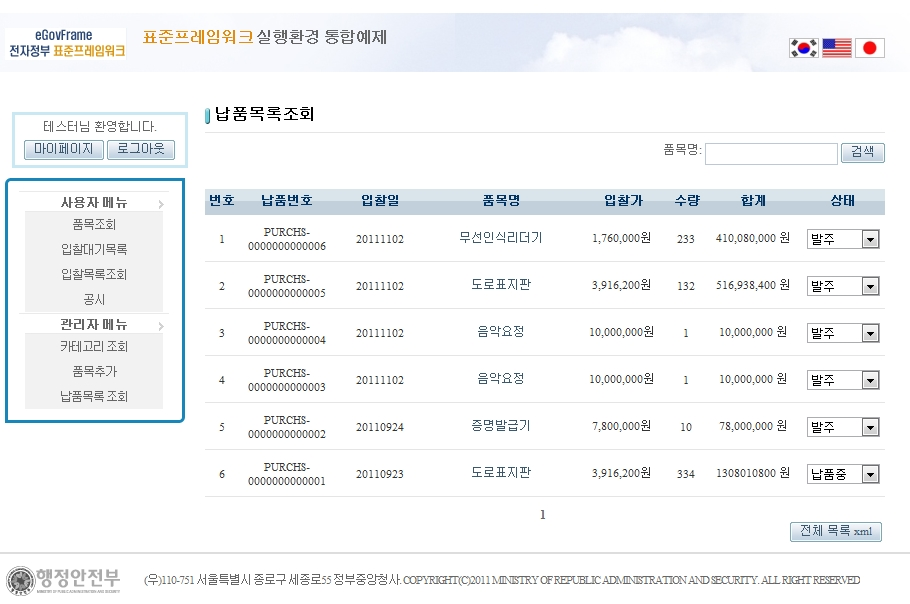
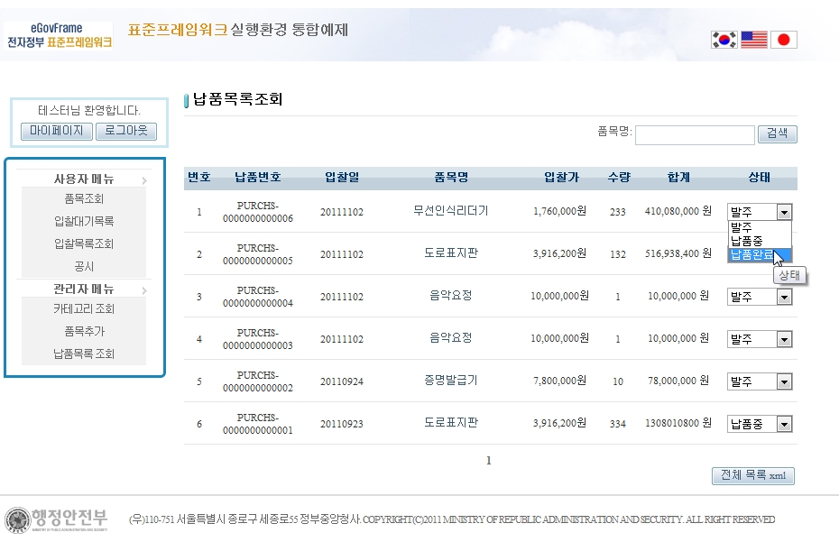
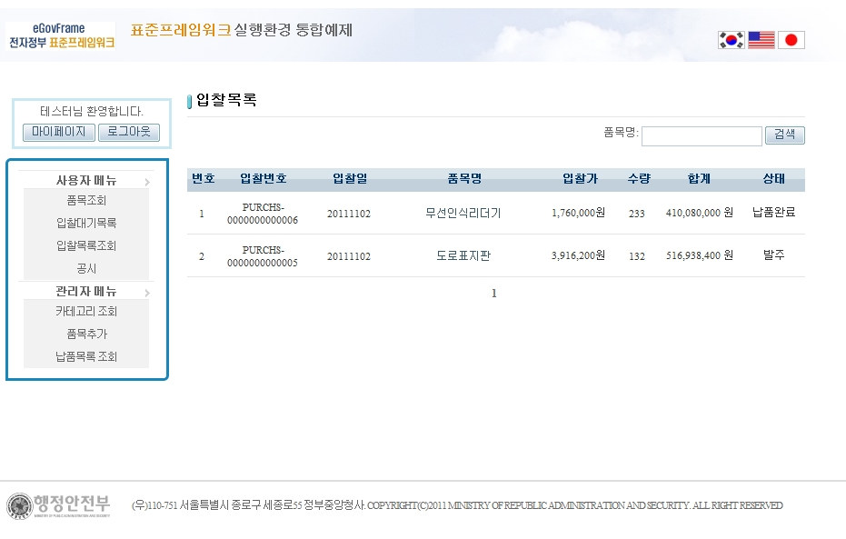

# 납품 관리

## 설명

 납품 관리는 관리자 권한에서 확인할 수 있으며, 회원의 입찰 목록을 출력하고, 납품 상태를 변경한다.

```bash
1. 관리자로 로그인 후 [납품목록 조회]를 선택한다.
```

 

```bash
2. 품목의 상태를 변경한다.
```

 

```bash
3. 다시 사용자로 로그인하여, [입찰목록조회]를 선택한 후 변경된 상태를 확인한다.
```

 

## 참고자료

- [SpEL](https://www.egovframe.go.kr/wiki/doku.php?id=egovframework:rte2:ptl:spel)
- [Server Security](https://www.egovframe.go.kr/wiki/doku.php?id=egovframework:rte2:fdl:server_security)
- [Internationalization(국제화)](https://www.egovframe.go.kr/wiki/doku.php?id=egovframework:rte2:ptl:internationalization)
- [Data Access](https://www.egovframe.go.kr/wiki/doku.php?id=egovframework:rte2:psl:data_access)
- [ID Generation](https://www.egovframe.go.kr/wiki/doku.php?id=egovframework:rte2:fdl:id_generation)
- [Property](https://www.egovframe.go.kr/wiki/doku.php?id=egovframework:rte2:fdl:property)