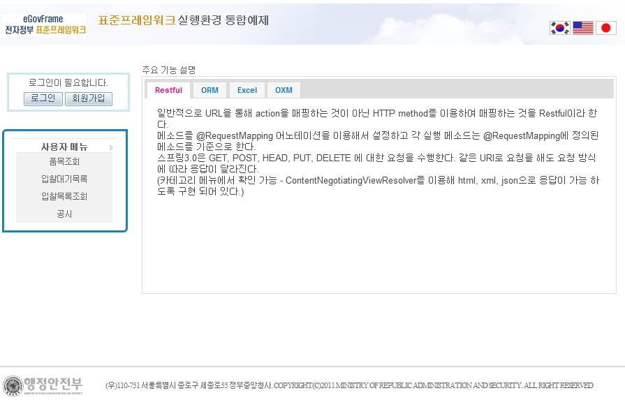
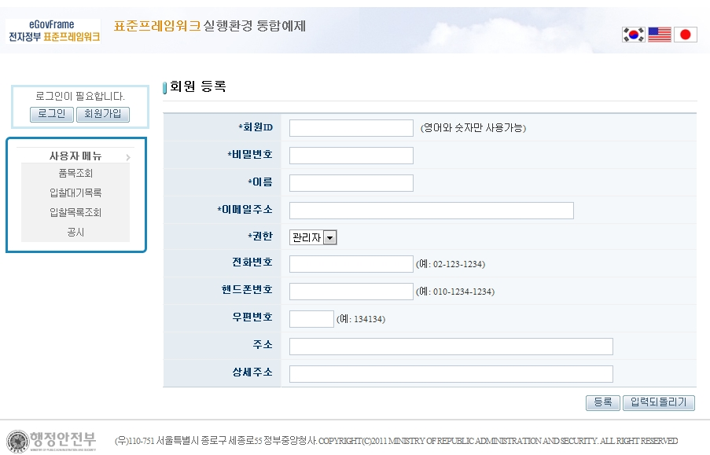
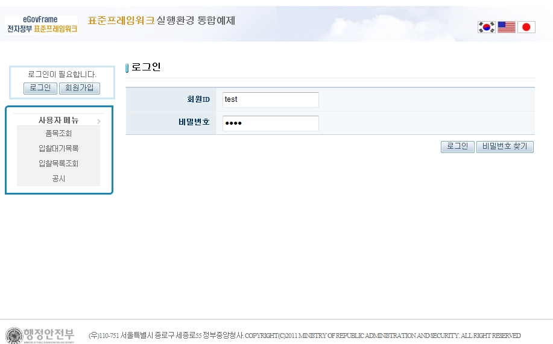
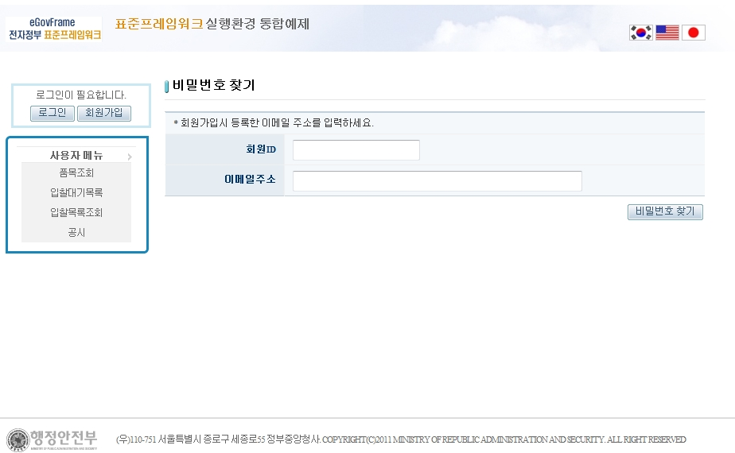
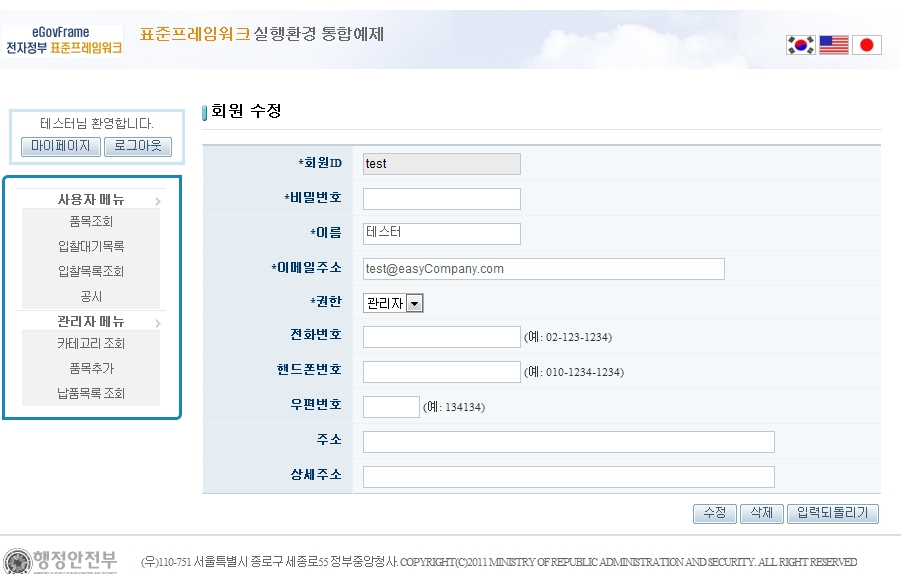
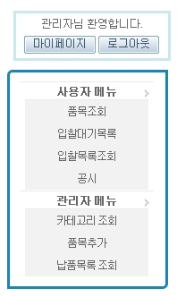
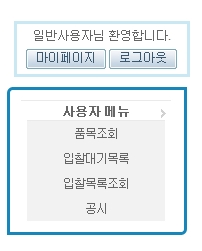

# 회원관리

## 설명

 사용자의 등급에 따라 사용할 수 있는 메뉴가 달라진다. 회원관리에서는 회원의 등록과 수정, 탈퇴가 가능하며 사용자 등급을 관리자와 일반 사용자로 구분하였다.

```bash
1. 메인페이지에서 회원가입을 클릭한다.
```

 

```bash
2. 회원정보를 입력하고 [등록]버튼을 클릭하여 회원등록을 한다.
```

 

```bash
3. 위에서 등록한 아이디와 비밀번호를 입력한다. (설치법에 따라 테이블을 생성했을 경우 - 관리자 아이디/비밀번호: admin/admin, 일반 사용자 아이디/비밀번호: user/user) 
```

 

```bash
4. 비밀번호를 분실하였을 경우 로그인 페이지에서 [비밀번호 찾기]를 클릭하여 메일로 임시 비밀번호를 발급받는다.
```

 

```bash
5. 로그인 후 [마이페이지]버튼을 클릭하여 회원 정보를 수정하거나, 탈퇴할 수 있다.
```

 

```bash
6. 일반사용자와 관리자는 접근 할 수 있는 메뉴가 다르다. 
```

  

## 참고자료

- [Declarative validation(JSR-303)](/egovframe-runtime/presentation-layer/web-servlet-declarative-validation.md)
- [AJAX](/egovframe-runtime/presentation-layer/ajax.md)
- [encryption_decryption](/egovframe-runtime/foundation-layer/crypto-encryption-decryption.md)
- [Mail](/egovframe-runtime/foundation-layer/mail.md)
- [SpEL](/egovframe-runtime/foundation-layer-core/spel.md)
- [Internationalization(국제화)](/egovframe-runtime/presentation-layer/internationalization.md)
- [Data Access](/egovframe-runtime/persistence-layer/dataaccess-ibatis.md)
- [ID Generation](/egovframe-runtime/foundation-layer/id-generation.md)
- [Property](/egovframe-runtime/foundation-layer/property-service.md)