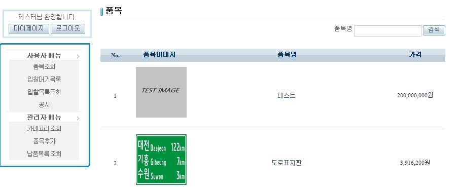
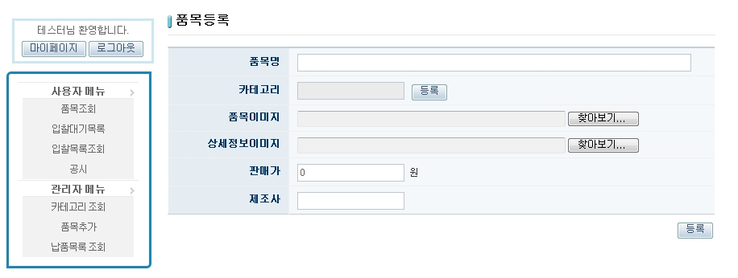
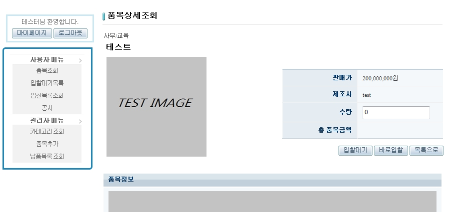
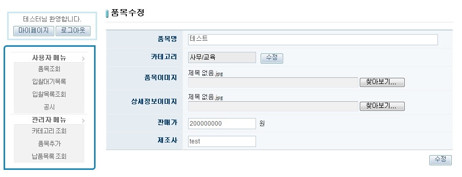

# 품목 관리

## 설명

 품목을 등록, 수정, 삭제 할 수 있으며 관리자에 한해 등록이 가능하다. 품목리스트는 엑셀과 xml로 출력 가능하다.

```bash
1. 메뉴에서 [품목조회]를 선택하여 품목을 조회할 수 있다. [전체 목록 엑셀 다운로드], [전체 목록 xml] 버튼을 클릭하여 목록을 엑셀과 xml로 확인할 수 있다.
```

 

```bash
2. 관리자로 로그인 한 후, 관리자 메뉴의 [품목 추가]를 선택하여 품목을 등록한다.
```

 

```bash
3. 등록을 완료 한 품목은 품목조회 화면에서 확인 가능하며, 관리자에 한해 수정, 삭제가 가능하다.
```

 

```bash
4. 품목조회 화면에서 [수정]버튼을 클릭하여 품목을 수정하고 품목조회 화면에서 수정된 품목을 확인한다.
```

 

## 참고자료

- [validation](https://www.egovframe.go.kr/wiki/doku.php?id=egovframework:rte2:ptl:validation)
- [SpEL](https://www.egovframe.go.kr/wiki/doku.php?id=egovframework:rte2:ptl:spel)
- [Security](https://www.egovframe.go.kr/wiki/doku.php?id=egovframework:rte2:ptl:security)
- [Server Security](https://www.egovframe.go.kr/wiki/doku.php?id=egovframework:rte2:fdl:server_security)
- [marshalling_unmarshalling](https://www.egovframe.go.kr/wiki/doku.php?id=egovframework:rte2:fdl:marshalling_unmarshalling)
- [file_upload_download](https://www.egovframe.go.kr/wiki/doku.php?id=egovframework:rte2:fdl:file_upload_download)
- [Excel](https://www.egovframe.go.kr/wiki/doku.php?id=egovframework:rte2:fdl:excel)
- [SpEL](https://www.egovframe.go.kr/wiki/doku.php?id=egovframework:rte2:ptl:spel)
- [Internationalization(국제화)](https://www.egovframe.go.kr/wiki/doku.php?id=egovframework:rte2:ptl:internationalization)
- [Data Access](https://www.egovframe.go.kr/wiki/doku.php?id=egovframework:rte2:psl:data_access)
- [ID Generation](https://www.egovframe.go.kr/wiki/doku.php?id=egovframework:rte2:fdl:id_generation)
- [Property](https://www.egovframe.go.kr/wiki/doku.php?id=egovframework:rte2:fdl:property)